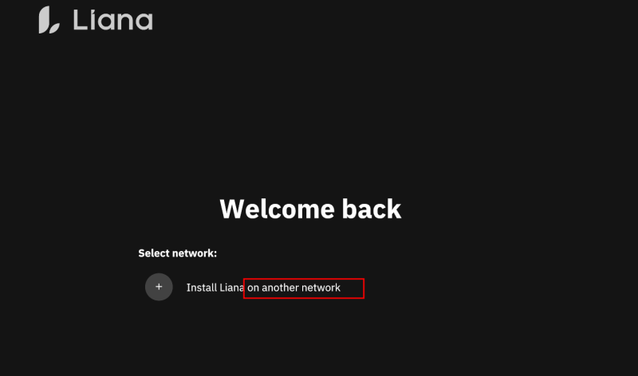
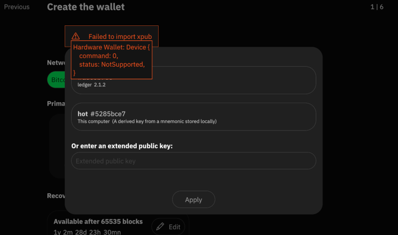
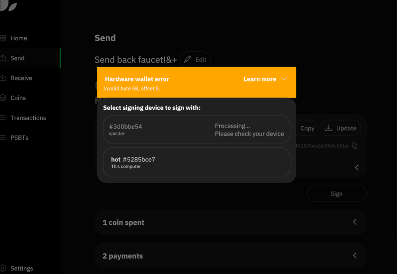
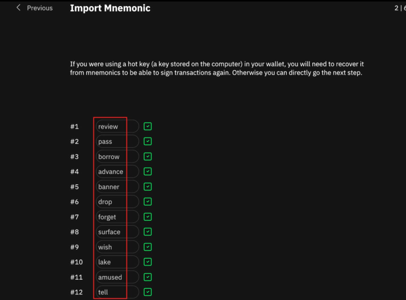
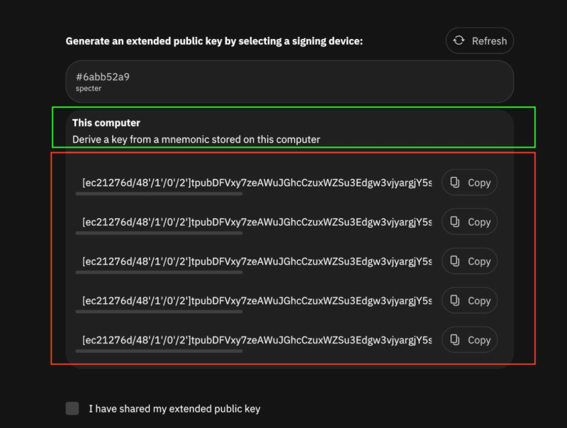
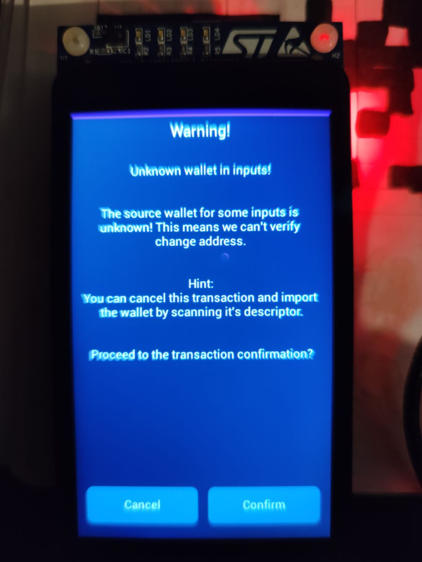
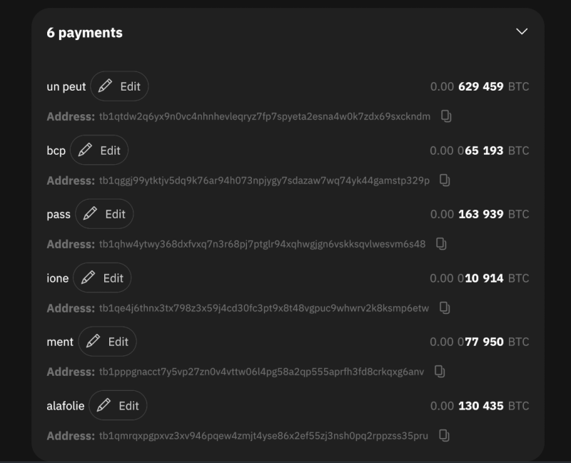
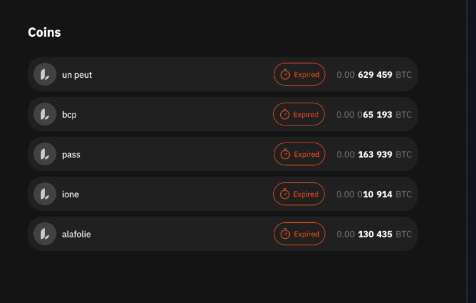

## Template

- [x] Prepare signet faucet wallet (Sparrow)
  - Mnemonic: rigid brother public ship curve holiday scrub plate furnace emerge weather derive
  - P2PKH Descriptor => pkh([f004c855/44h/1h/0h]tpubDDmdqvCYBbUfSTV9r32Y9YeVH6tGySpK9VcxtZkXzpCLnZGZjD4D3RFNzNY2zRX9R22NsnGDhdXzieRhcmH7hKzcRn4aNqXusshoofHaieL/<0;1>/*)#65t0v9j8
  - P2WPKH Descriptor => wpkh([f004c855/84h/1h/0h]tpubDDHWhCWGVx5BKaQRB55MTSwRJxNweb7YcXbiFBSgTjKn9sZ7xsGd6KxniBKZ1JiAk5EqL82ACfKPDtDnYYL7AhPYmDXDMpdjg2stjWkQ9m6/<0;1>/*)#49r7mq6p
  - P2SH-P2WPKH Descriptor => sh(wpkh([f004c855/49h/1h/0h]tpubDCw3mF6vhBuv44sHkWtQdU2M7KNw9xUgrmzyZ9aK1utwegRWpd6GWjsvZiq3pnfdvNf8AX6kc82QweEXQ3HMoUoUQbiv7Qc6Z975KuT2G7Z/<0;1>/*))#0umhqc52
  - P2TR Descriptor => tr([f004c855/86h/1h/0h]tpubDCQ5sLb3EZF5wgPzGaB9Nsxp9MAgfMhvmwxmjkYsSCFEp696nqrzDXWrZ9c3niMkpXbGJK78cVAy7QPkRotRshRAr26pMLsANA2uKEDFzqj/<0;1>/*)#y4mmnsqu

- [ ] Install Win10
- [ ] Install Debian12
- [ ] Install Ubuntu 22.04/22.10/23.04/23.10
- [ ] Install Arch
- [x] IBD testnet linux
- [ ] IBD Mainnet Win10
- [x] Build Arch commit 1a59d0385844e7fbe345d18bb472736c0d1e0554 

- [ ] Setup 1 => from zero (Signet Managed by Liana)
  - [x] Generate 1 hot seed (A)
    - [5285bce7/48'/0'/0'/2']xpub6DmCd7NkdSQRJzdLkFAd8JSakhZGSQPKmvupwCr5CyWFRMhfCVff3HoRWyseSj4yMZctveQfuvJ8CARpWDkXHew1zpszrevWiakDUxvK8SG
    - review pass borrow advance banner drop forget surface wish lake amused tell
  - [x] Generate seed on Specter (B)
    - hotel organ vacuum praise bacon gentle love another absurd crystal cloud window
      TODO: add SeedQR for quick import into specter
    - [6abb52a9/84h/1h/0h]tpubDDUkRNbJND67zyFYU1mKkhosCg9ueKjUvQv8boZo7mABEwC4whpyUT3aQbXRX4JzQwkDqiPsrZxFBzjQX1uooBdBDrYELyAq8uKMB51Udpr
  - [ ] Generate seed on nano S+ (C)
        TODO
  - [x] Generate new wallet multi(3, A, B, C) | multi(2, A, B, C) & 10 blocs | multi(1, A, B, C) & 20 Blocs
  - [x] POR on ledger
  - [x] Register on specter
  - [x] Let Liana handle node
  - [x] Receive from faucet (1 coin, no change)
  - [x] send back to faucet (2 coins, + change) primary path

  - [x] Lost machine 1 => restore wallet
    - [x] Import A on machine 3
    - [x] Import B on machine 3
    - [x] Import descriptor on machine 3
    - [x] Rescan
    - [x] Recovery with path2 (A + B) on P2TR faucet

- [x] Erase .liana + .bitcoin (signet) on both machines

- [x] Setup 2 => using participate using our own bitcoind running on signet
  - [x] Machine 1 handle A and B 
    - hot
    - muscle thing bless sun chalk switch chair chaos flower endless panda auction
  - [x] Machine 2 handle C 
  - [x] Tx generated on machine 2 send by PSBT to machine 1
  - [x] Recovery with path3 (B) to faucet P2WPKH

- [x] Test labels
- [x] Try to import an outdated (already spend PSBT)

- [x] Import wallet from an older Liana Version v2 => v3 (PR#751)

- [ ] Try do do a 'participate' wallet with machine1 on v2 and machine2 on v3

- [ ] Check against PR #555 => install on a fresh Debian -> build essential needed

## Notes

- Still 'Install Liana on another network' on fresh install 

- If i try to import xpub w/ ledger using wrong app (liana = mainnet, ledger = signer), 
  the hint message is not clear 

- If i sign w/ specter using a wrong key, the message is not clear (why i can sign with a wrong key on specter??) 
  => can we detect this for display a better msg?

- When importing a mnemonic, teh text field are not centered

- During restore wallet flow, we ask user to backup descriptor just after user supply the descriptor
  nit, but kinda weird.

- In case of a multi participant setup, it could be cool to have an `offline` mode in case one participant just
  want signing without running a node.
  
- When change output is lower than some amount, liana don't add a change output, can we offer the user to 'tip' receiver?
  We should not do it silently as some payment processor or receiver detect mismatching amount as 'wrong' payment.

- When creating a wallet in ‘participate mode’ if we click several times on the ‘this computer....’, every click we 
  add one more descriptor (always the same)

- In participate mode, we should write the mnemonic on disk & give it to backup to user before share it => what if 
 crash and lost mnemonic (or just the not experienced user (grandma?) stop the flow there) and don't notice
 he don't have backup?

- When creating a wallet, should we avoid the ‘apply’ button step after selecting a xpub? (nit)

- can we allow 2nd, 3rd, etc path to have the same timelock (just a hint)(not red)? 
 it can, on purpose, allow to have some OR in our path, without having to use a timelock+1 branch....

- If a setup is used in participate mode by several ppl on several machine, does the receive/change index 
  are updated if we receive coins on address with index over the local one? if not this can made ppl do address 
  reuse without notice it, if they create tx from several machine.

- Limit the amount of float digit for amount in spend page?

- Using specter to sign a recovery tx, i got this hint even if policy registered 

- Something weird with coins display: in the Transaction page i have the 6 inputs of my tx
  but in ‘Coin’ page only 5 displayed

