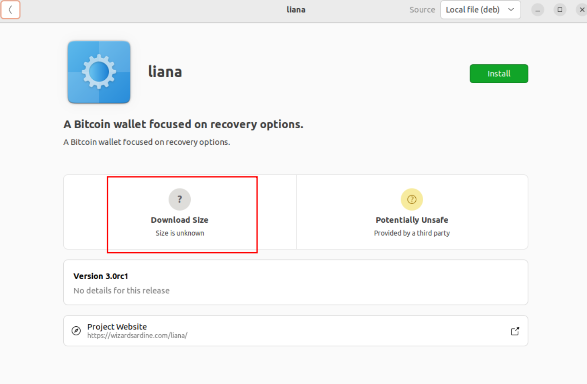

- [ ] Install Win10
- [x] Install Debian12
- [x] Install Ubuntu 22.04
- [x] Install Ubuntu 22.10
- [x] Install Ubuntu 23.04
- [ ] Install Ubuntu 23.10
- [ ] IBD Mainnet Win10

## Setup
- [x] Generate 1 hot seed (A)
  - [fb3315e0/48'/1'/0'/2']tpubDFNtC2spSkgW1m3zEjVnDmKd5xKoXtXwT3BCSeatqjxWMzpdXPFBCg8M84RdKeYCzy4jCYM9BCx5kPXiEt3mDjJGa3KLpfcSzpQfEZU3Fa8
  - wave ozone second better guide enroll conduct echo spread host beyond cheese
- [x] Import Specter(B)
  - hotel organ vacuum praise bacon gentle love another absurd crystal cloud window
  - Scan SeedQR [here](TODO)
  - [6abb52a9/84h/1h/0h]tpubDDUkRNbJND67zyFYU1mKkhosCg9ueKjUvQv8boZo7mABEwC4whpyUT3aQbXRX4JzQwkDqiPsrZxFBzjQX1uooBdBDrYELyAq8uKMB51Udpr
- [x] Import Ledger (C)

- [ ] Generate new wallet multi(2, B, C) | multi(1, B, C) & 10 blocks | A & 20 Blocks
  wsh(or_i(and_v(v:pkh([fb3315e0/48'/1'/0'/2']tpubDFNtC2spSkgW1m3zEjVnDmKd5xKoXtXwT3BCSeatqjxWMzpdXPFBCg8M84RdKeYCzy4jCYM9BCx5kPXiEt3mDjJGa3KLpfcSzpQfEZU3Fa8/<0;1>/*),older(20)),or_d(multi(2,[a5c6b76e/48'/1'/0'/2']tpubDF5861hj6vR3iJr3aPjGJz4rNbqDCRujQ21mczzKT5SiedaQqNVgHC8HT9ceyxvMFRoPMx4P6HAcL3NZrUPhRUbwCyj3TKSa64bAfnE3sLh/<0;1>/*,[6abb52a9/48'/1'/0'/2']tpubDFZTCVU1Sa9nJXCxx97UFvGausHQPFjJyaiDbdr8GNqjCLKwYc8ihegK7yJdcizs9HMbiGA7ke1HiCENVHaERvNANHW7U2Wo2qnRsuqB52r/<0;1>/*),and_v(v:thresh(2,pkh([a5c6b76e/48'/1'/0'/2']tpubDF5861hj6vR3iJr3aPjGJz4rNbqDCRujQ21mczzKT5SiedaQqNVgHC8HT9ceyxvMFRoPMx4P6HAcL3NZrUPhRUbwCyj3TKSa64bAfnE3sLh/<2;3>/*),a:pkh([6abb52a9/48'/1'/0'/2']tpubDFZTCVU1Sa9nJXCxx97UFvGausHQPFjJyaiDbdr8GNqjCLKwYc8ihegK7yJdcizs9HMbiGA7ke1HiCENVHaERvNANHW7U2Wo2qnRsuqB52r/<2;3>/*)),older(10)))))#3khunf64
- [x] Register on B
- [x] Register on C ( i had to register a second time???)
- [x] Receive from <type> faucet (1 coin, 1 change)
- [x] send back to <type> faucet (1 coins, 0 change) primary path

## Setup bis
- [x] Generate 1 hot seed (A)
  - [8502db46/48'/1'/0'/2']tpubDF72mrvUvMRdLwezH5fEL641sNYsX1ePJ8W3KQVkdAgEN1GVgs1VFETbjEMVJoMu9CDE6iUNTVaUmNRK7zPUQi7DV31hCowDChikPRBjpFW
  - juice engage grace grief regular saddle snack alert tiny tail cheap ill
- [x] Import Specter(B)
  - hotel organ vacuum praise bacon gentle love another absurd crystal cloud window
  - Scan SeedQR [here](TODO)
  - [6abb52a9/84h/1h/0h]tpubDDUkRNbJND67zyFYU1mKkhosCg9ueKjUvQv8boZo7mABEwC4whpyUT3aQbXRX4JzQwkDqiPsrZxFBzjQX1uooBdBDrYELyAq8uKMB51Udpr
- [x] Import Ledger (C)

- [x] Generate new wallet multi(2, B, C) | multi(1, B, C) & 10 blocks | A & 20 Blocks
  wsh(or_i(and_v(v:pkh([8502db46/48'/1'/0'/2']tpubDF72mrvUvMRdLwezH5fEL641sNYsX1ePJ8W3KQVkdAgEN1GVgs1VFETbjEMVJoMu9CDE6iUNTVaUmNRK7zPUQi7DV31hCowDChikPRBjpFW/<0;1>/*),older(20)),or_d(multi(2,[a5c6b76e/48'/1'/0'/2']tpubDF5861hj6vR3iJr3aPjGJz4rNbqDCRujQ21mczzKT5SiedaQqNVgHC8HT9ceyxvMFRoPMx4P6HAcL3NZrUPhRUbwCyj3TKSa64bAfnE3sLh/<0;1>/*,[6abb52a9/48'/1'/0'/2']tpubDFZTCVU1Sa9nJXCxx97UFvGausHQPFjJyaiDbdr8GNqjCLKwYc8ihegK7yJdcizs9HMbiGA7ke1HiCENVHaERvNANHW7U2Wo2qnRsuqB52r/<0;1>/*),and_v(v:thresh(1,pkh([a5c6b76e/48'/1'/0'/2']tpubDF5861hj6vR3iJr3aPjGJz4rNbqDCRujQ21mczzKT5SiedaQqNVgHC8HT9ceyxvMFRoPMx4P6HAcL3NZrUPhRUbwCyj3TKSa64bAfnE3sLh/<2;3>/*),a:pkh([6abb52a9/48'/1'/0'/2']tpubDFZTCVU1Sa9nJXCxx97UFvGausHQPFjJyaiDbdr8GNqjCLKwYc8ihegK7yJdcizs9HMbiGA7ke1HiCENVHaERvNANHW7U2Wo2qnRsuqB52r/<2;3>/*)),older(10)))))#0rjgnkdt
- [ ] Register on B
- [ ] Register on C ( i had to register a second time???)
- [ ] Receive from <type> faucet (<?> coin, <?> change)
- [ ] send back to <type> faucet (<?> coins, <?> change) primary path

## Setup Ter
### settings after 1rst ledger registration
{
  "wallets": [
    {
      "name": "Liana",
      "descriptor_checksum": "7gqxszsp",
      "keys": [
        {
          "name": "ledger",
          "master_fingerprint": "a5c6b76e"
        },
        {
          "name": "specter",
          "master_fingerprint": "6abb52a9"
        },
        {
          "name": "ledger",
          "master_fingerprint": "a5c6b76e"
        },
        {
          "name": "specter",
          "master_fingerprint": "6abb52a9"
        },
        {
          "name": "hot",
          "master_fingerprint": "4777360a"
        }
      ],
      "hardware_wallets": [
        {
          "kind": "ledger",
          "fingerprint": "a5c6b76e",
          "token": "b44a6c1377bca09a6064add375ad811f3daf9d4c9979b99991d326636306abd6"
        }
      ]
    }
  ]
}

### settings after 2nd ledger registration
{
  "wallets": [
    {
      "name": "Liana",
      "descriptor_checksum": "7gqxszsp",
      "keys": [
        {
          "name": "ledger",
          "master_fingerprint": "a5c6b76e"
        },
        {
          "name": "specter",
          "master_fingerprint": "6abb52a9"
        },
        {
          "name": "ledger",
          "master_fingerprint": "a5c6b76e"
        },
        {
          "name": "specter",
          "master_fingerprint": "6abb52a9"
        },
        {
          "name": "hot",
          "master_fingerprint": "4777360a"
        }
      ],
      "hardware_wallets": [
        {
          "kind": "ledger",
          "fingerprint": "a5c6b76e",
          "token": "0cd297e814622f9f14874761e45013e02bf6bbfa29042668295c107aebba742f"
        }
      ]
    }
  ]
}

## Misc.

- [x] Check against PR #555 => install on a fresh Debian -> build essential needed

- [ ] Try to do a 'participate' wallet with machine1 on v2 and machine2 on v3 + spend

Check: in the restore wallet flow, we can import a descriptor and a mnenonic that not match, its confusing as 
we dont notice why we cannot sign later.....

## Notes

- Installing with ubuntu package manager, the size of package is not displayed, i think we can specify it 
  in the package metadata (should add `du` to check size of package in the build script?)
  Can we do something for the 'Potentially unsafe' hint?

