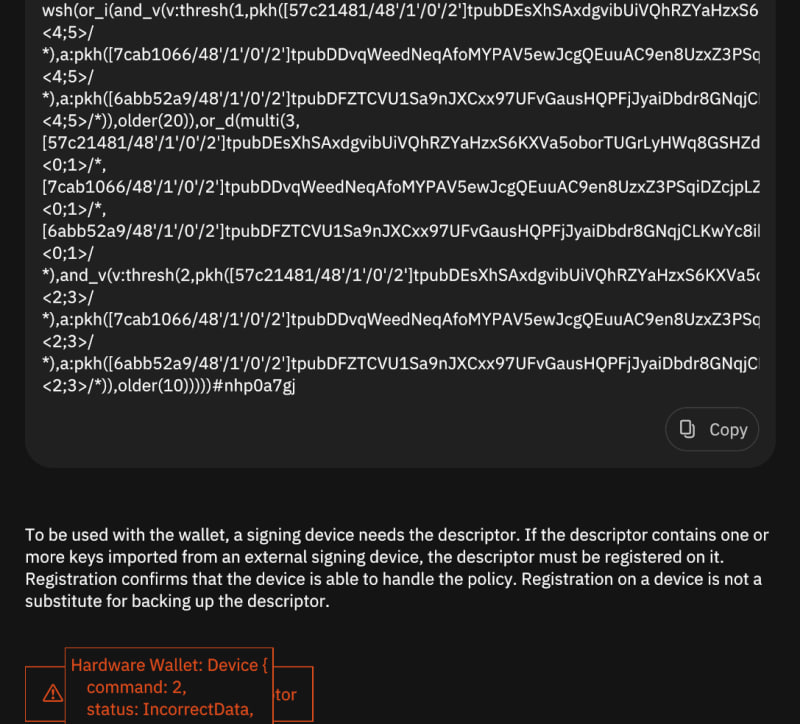
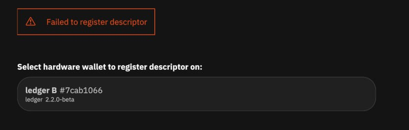
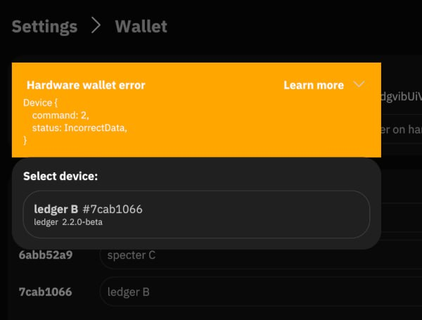

# Template

- [ ] Install Win10
- [ ] Install Debian12
- [ ] Install Ubuntu 22.04/22.10/23.04/23.10
- [ ] Install Arch
- [ ] IBD Mainnet <platform>
- [x] Build arch commit fe14cbec5812981ed25c7a400fadcabfb11cf444
- [x] IBD testnet arch

## Setup 1 => from zero (Signet Managed by Liana)

- [x] Generate 1 hot seed (A)
  - [57c21481/48'/1'/0'/2']tpubDEsXhSAxdgvibUiVQhRZYaHzxS6KXVa5oborTUGrLyHWq8GSHZdRU2ToGhjuYc3KLVYPtPftFGkjrMPUw6zxWZxaoN3v2zSzxAXftMxz95z
  - define jealous drill wrap item shallow chest balcony domain dignity runway year
- [x] Import seed #1 on Nano S (B)
  - bomb sphere swim sphere must frame bounce ticket title winner tide decrease shuffle minute ugly seminar dash awful calm olive census girl merit smooth
  - [7cab1066/48'/1'/0'2']tpubDDvqWeedNeqAfoMYPAV5ewJcgQEuuAC9en8UzxZ3PSqiDZcjpLZSXs9yu2S4hYcQb6S7UrSy8eBvk199WgzAsjWmaE8TW87q3riXfWcRQ6
- [x] Import seed #2 on specter (C)
  - hotel organ vacuum praise bacon gentle love another absurd crystal cloud window
  - [6abb52a9/48'/1'/0'2']tpubDFZTCVU1Sa9nJXCxx97UFvGausHQPFjJyaiDbdr8GNqjCLKwYc8ihegK7yJdcizs9HMbiGA7ke1HiCENVHaERvNANHW7U2Wo2qnRuqB52r
- [x] Generate new wallet multi(A, B, C) | thresh(2, A, B, C) & 10 blocs | thresh(1, A, B, C) & 20 Blocs
  - wsh(or_i(and_v(v:thresh(1,pkh([57c21481/48'/1'/0'/2']tpubDEsXhSAxdgvibUiVQhRZYaHzxS6KXVa5oborTUGrLyHWq8GSHZdRU2ToGhjuYc3KLVYPtPftFGkjrMPUw6zxWZxaoN3v2zSzxAXftMxz95z/<4;5>/*),a:pkh([7cab1066/48'/1'/0'/2']tpubDDvqWeedNeqAfoMYPAV5ewJcgQEuuAC9en8UzxZ3PSqiDZcjpLZSXs9yu2S4hYcQb6S7UrSy8eBvk199WgzAsjWmaE8TW87q3riaXfWcRQ6/<4;5>/*),a:pkh([6abb52a9/48'/1'/0'/2']tpubDFZTCVU1Sa9nJXCxx97UFvGausHQPFjJyaiDbdr8GNqjCLKwYc8ihegK7yJdcizs9HMbiGA7ke1HiCENVHaERvNANHW7U2Wo2qnRsuqB52r/<4;5>/*)),older(20)),or_d(multi(3,[57c21481/48'/1'/0'/2']tpubDEsXhSAxdgvibUiVQhRZYaHzxS6KXVa5oborTUGrLyHWq8GSHZdRU2ToGhjuYc3KLVYPtPftFGkjrMPUw6zxWZxaoN3v2zSzxAXftMxz95z/<0;1>/*,[7cab1066/48'/1'/0'/2']tpubDDvqWeedNeqAfoMYPAV5ewJcgQEuuAC9en8UzxZ3PSqiDZcjpLZSXs9yu2S4hYcQb6S7UrSy8eBvk199WgzAsjWmaE8TW87q3riaXfWcRQ6/<0;1>/*,[6abb52a9/48'/1'/0'/2']tpubDFZTCVU1Sa9nJXCxx97UFvGausHQPFjJyaiDbdr8GNqjCLKwYc8ihegK7yJdcizs9HMbiGA7ke1HiCENVHaERvNANHW7U2Wo2qnRsuqB52r/<0;1>/*),and_v(v:thresh(2,pkh([57c21481/48'/1'/0'/2']tpubDEsXhSAxdgvibUiVQhRZYaHzxS6KXVa5oborTUGrLyHWq8GSHZdRU2ToGhjuYc3KLVYPtPftFGkjrMPUw6zxWZxaoN3v2zSzxAXftMxz95z/<2;3>/*),a:pkh([7cab1066/48'/1'/0'/2']tpubDDvqWeedNeqAfoMYPAV5ewJcgQEuuAC9en8UzxZ3PSqiDZcjpLZSXs9yu2S4hYcQb6S7UrSy8eBvk199WgzAsjWmaE8TW87q3riaXfWcRQ6/<2;3>/*),a:pkh([6abb52a9/48'/1'/0'/2']tpubDFZTCVU1Sa9nJXCxx97UFvGausHQPFjJyaiDbdr8GNqjCLKwYc8ihegK7yJdcizs9HMbiGA7ke1HiCENVHaERvNANHW7U2Wo2qnRsuqB52r/<2;3>/*)),older(10)))))#nhp0a7gj
- [ fail ] Register on B
- [x] Register on C
- [x] Let Liana handle bitcoind
- [x] kill liana during IBD (SIGTERM)
- [x] restart liana
- [x] stop liqnq normal way
- [x] restart laptop
- [x] restart liana
- [x] IBD ends up properly (less than 10 min)
- [fail] verify addresses on nano s (missing policy)
- [x] Receive from P2WPKH faucet (2 coin, 1 change, txid 33104a5276b40a047177abe18278bb0e934872b72b28a4f208114ad8b4668e58)
- [x] add labels
- [x] cancel on sparrow side (RBF  txid f71b965589f6d51a3804628f067a89efbc0e298ac42c73fb0157597906afcf05)
- [x] Receive from P2WPKH faucet (1 coin, 1 change, txid 8a45088fabbca50c629d7b167a1cc607409a36da64748f890d874975dd0c9e87)
- [cannot register B] send back to <type> faucet (<?> coins, <?> change) primary path


## Simulate Lost machine 1 => restore wallet + recovery

- [x] Import A on machine 2
- [x] Import descriptor on machine 2
- [x] register signer C on machine 2
- [x] register signer B on machine 2
- [fail same machine 1] Register B on machine 3
- [ ] Recovery with path2 (A + C) on P2TR faucet

### Notes about registering issues





trying register via async-hwi:
```
~ ❯ hwi wallet register --name "liana-nhp0a7gj" --policy "wsh(or_i(and_v(v:thresh(1,pkh([57c21481/48'/1'/0'/2']tpubDEsXhSAxdgvibUiVQhRZYaHzxS6KXVa5oborTUGrLyHWq8GSHZdRU2ToGhjuYc3KLVYPtPftFGkjrMPUw6zxWZxaoN3v2zSzxAXftMxz95z/<4;5>/*),a:pkh([7cab1066/48'/1'/0'/2']tpubDDvqWeedNeqAfoMYPAV5ewJcgQEuuAC9en8UzxZ3PSqiDZcjpLZSXs9yu2S4hYcQb6S7UrSy8eBvk199WgzAsjWmaE8TW87q3riaXfWcRQ6/<4;5>/*),a:pkh([6abb52a9/48'/1'/0'/2']tpubDFZTCVU1Sa9nJXCxx97UFvGausHQPFjJyaiDbdr8GNqjCLKwYc8ihegK7yJdcizs9HMbiGA7ke1HiCENVHaERvNANHW7U2Wo2qnRsuqB52r/<4;5>/*)),older(20)),or_d(multi(3,[57c21481/48'/1'/0'/2']tpubDEsXhSAxdgvibUiVQhRZYaHzxS6KXVa5oborTUGrLyHWq8GSHZdRU2ToGhjuYc3KLVYPtPftFGkjrMPUw6zxWZxaoN3v2zSzxAXftMxz95z/<0;1>/*,[7cab1066/48'/1'/0'/2']tpubDDvqWeedNeqAfoMYPAV5ewJcgQEuuAC9en8UzxZ3PSqiDZcjpLZSXs9yu2S4hYcQb6S7UrSy8eBvk199WgzAsjWmaE8TW87q3riaXfWcRQ6/<0;1>/*,[6abb52a9/48'/1'/0'/2']tpubDFZTCVU1Sa9nJXCxx97UFvGausHQPFjJyaiDbdr8GNqjCLKwYc8ihegK7yJdcizs9HMbiGA7ke1HiCENVHaERvNANHW7U2Wo2qnRsuqB52r/<0;1>/*),and_v(v:thresh(2,pkh([57c21481/48'/1'/0'/2']tpubDEsXhSAxdgvibUiVQhRZYaHzxS6KXVa5oborTUGrLyHWq8GSHZdRU2ToGhjuYc3KLVYPtPftFGkjrMPUw6zxWZxaoN3v2zSzxAXftMxz95z/<2;3>/*),a:pkh([7cab1066/48'/1'/0'/2']tpubDDvqWeedNeqAfoMYPAV5ewJcgQEuuAC9en8UzxZ3PSqiDZcjpLZSXs9yu2S4hYcQb6S7UrSy8eBvk199WgzAsjWmaE8TW87q3riaXfWcRQ6/<2;3>/*),a:pkh([6abb52a9/48'/1'/0'/2']tpubDFZTCVU1Sa9nJXCxx97UFvGausHQPFjJyaiDbdr8GNqjCLKwYc8ihegK7yJdcizs9HMbiGA7ke1HiCENVHaERvNANHW7U2Wo2qnRsuqB52r/<2;3>/*)),older(10)))))#nhp0a7gj"
Error: Device("Device {\n    command: 2,\n    status: IncorrectData,\n}")
```

## 'Participate' Setup using standalone bitcoind

### Machine 1 handle A and B using 'participate' mode
  
  - [ ] Generate 1 hot seed (A)
    - <xpub>
    - <mnemonics>
  - [ ] Register B on machine 1
  - [ ] Share xpubs A & B to machine 2

### Machine 2 handle C using 'create' mode

- [ ] Import A & B xpubs
- [ ] Connect signer C
- [ ] Generate wallet
- [ ] Register descriptor on signer C
- [ ] receive coins from faucet wallet
- [ ] prepare tx and send to machine 1 (PSBT)
- [ ] share descriptor w/ machine 1

### Back to machine 1
- [ ] Import descriptor
- [ ] Register descriptor on signer B
- [ ] import and sign with A & B tx generated on machine 2 
- [ ] send back PSBT to machine 2

### Back to machine 2
- [ ] Import PSBT
- [ ] Sign w/ signer C
- [ ] Broadcast

## Notes


