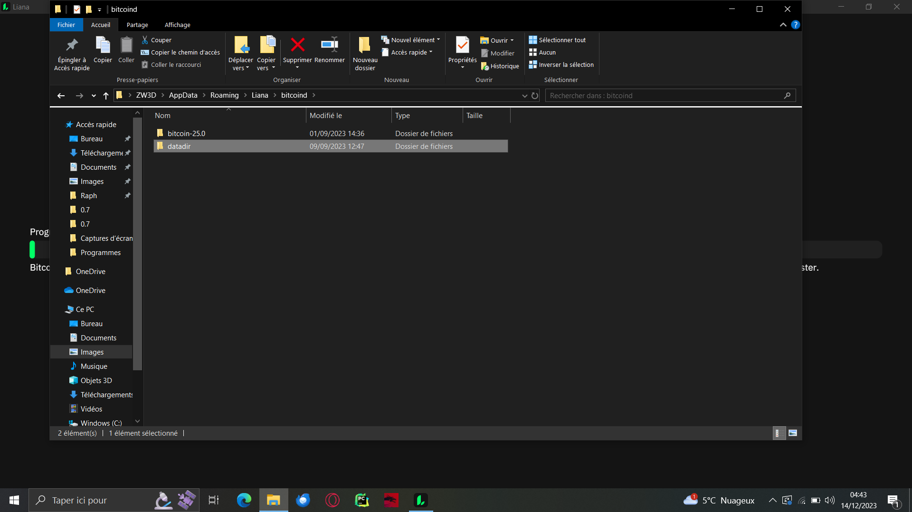
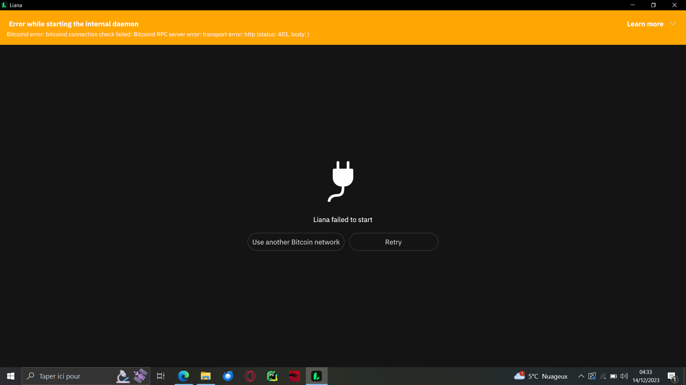
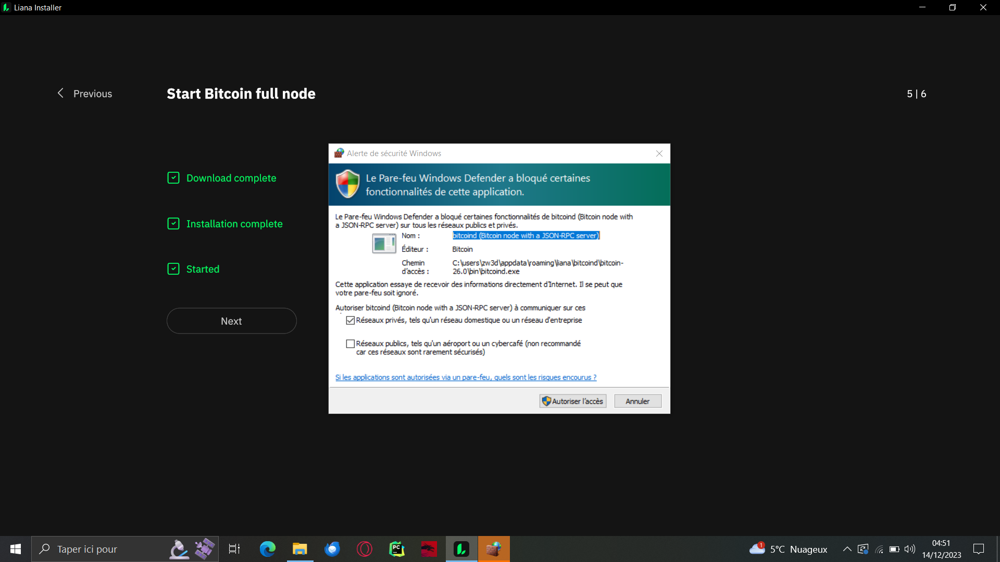

# Template

- [x] Install Win10 Liana V4.0rc1

## Upgrade from V2.rc2 on Win10 (Signet)

This machine have been used previously for v2.rc1/v2.rc2 testing on mainnet/signet.

Previously using bitcoind25.0 and have signet full IBD Done.

- ?! no download of latest bitcoind !?

- Bitcoind error while starting daemon

- click on retry button => state is frozen at 0% after few minutes
- Stop liana
- Restart liana
- After 5min sync, only 0.4% sync ( 0% -> 0.4%) while %APPDATA%/Liana/bitcoind/datadir/signet/blocks size is around 700Mb.
- Stop liana at 0.7% (10 min)
- Rename %APPDATA%/Liana in Liana2
- Restart liana
- setup new wallet
    - Liana download bitcoind 26.0
    - Got a firewall alert
        
        
    - IBD Started (5:21)
    - IBD Ended (6:50) ==> why soo long? Windows firewall?

## Notes

- it seems that firewall alert is trigger every time we start the node
- Downloading liana w/ edge browser we had a hint we need to bypass for download
- We Should do an installer
- Usual warnings
- Why IBD Soooo long?

## 'Participate' Setup 

### Machine 1 (Linux) handle A and B using 'participate' mode
  
- [x] Generate 1 hot seed (A)
  - action option dinosaur place fatigue modify bunker receive wife print kingdom gauge
  - [bfb23fc6/48'/1'/0'/2']tpubDEYyNjWy6MGGdJucxnTyPWXCUbEzrZjMerxz66N7WRTgk8xg8BS7rRbBt6q8NPfbeb8R9bfqdYGozqGE5CVgt679ifE4PUJg7NutXC7PbU5
- [x] Import seed #1 on Nano S (B)
  - bomb sphere swim sphere must frame bounce ticket title winner tide decrease shuffle minute ugly seminar dash awful calm olive census girl merit smooth
  - [7cab1066/48'/1'/0'2']tpubDDvqWeedNeqAfoMYPAV5ewJcgQEuuAC9en8UzxZ3PSqiDZcjpLZSXs9yu2S4hYcQb6S7UrSy8eBvk199WgzAsjWmaE8TW87q3riXfWcRQ6

  - [x] Share xpubs A & B to machine 2

### Machine 2 (Win10) handle C & D using 'create' mode

- [x] Import A & B xpubs
- [x] Generate 1 hot seed (D)
  - anchor chef remember bleak nerve taxi wish clump spring february prize local
  - 
- [x] Import seed #1 on Nano S (B)
  - bomb sphere swim sphere must frame bounce ticket title winner tide decrease shuffle minute ugly seminar dash awful calm olive census girl merit smooth
  - [7cab1066/48'/1'/0'2']tpubDDvqWeedNeqAfoMYPAV5ewJcgQEuuAC9en8UzxZ3PSqiDZcjpLZSXs9yu2S4hYcQb6S7UrSy8eBvk199WgzAsjWmaE8TW87q3riXfWcRQ6
- [x] Import seed #2 on specter (C)
  - hotel organ vacuum praise bacon gentle love another absurd crystal cloud window
  - [6abb52a9/48'/1'/0'2']tpubDFZTCVU1Sa9nJXCxx97UFvGausHQPFjJyaiDbdr8GNqjCLKwYc8ihegK7yJdcizs9HMbiGA7ke1HiCENVHaERvNANHW7U2Wo2qnRuqB52r
- [fail] Connect signer C => specter is not detected on Win10 
- [x] Generate wallet multi(A, B, C, D) | thresh(3, A, B, C, D) & 65535 
- [fail] Register descriptor on signer C
- [fail] Register descriptor on signer B => IncorrectData error
- [ ] receive coins from faucet wallet
- [ ] prepare tx and send to machine 1 (PSBT)
- [ ] share descriptor w/ machine 1

### Back to machine 1
- [ ] Import descriptor
- [ ] Register descriptor on signer B
- [ ] import and sign with A & B tx generated on machine 2 
- [ ] send back PSBT to machine 2

### Back to machine 2
- [ ] Import PSBT
- [ ] Sign w/ signer C
- [ ] Broadcast

## Notes

- when doing a participate setup, whe should supply to user a single file containing at least descriptor + pubkeys aliases

## Issue to open
- [x] Warn user if they using a Nano S w/ a too big script (we should do some test to make a 'table' of wich template are allowed,
as some descriptor template w/ a size < 192 chqr cannot be signed by Nano S, as in my v4-rc1 / v4-pre-rc-1 testing round)
- [x] Downloading liana w/ edge browser we had a hint we need to bypass for download
- [x] Windows installer?
- [ ]Specter is not detected on Win10
- [ ]Translation?
