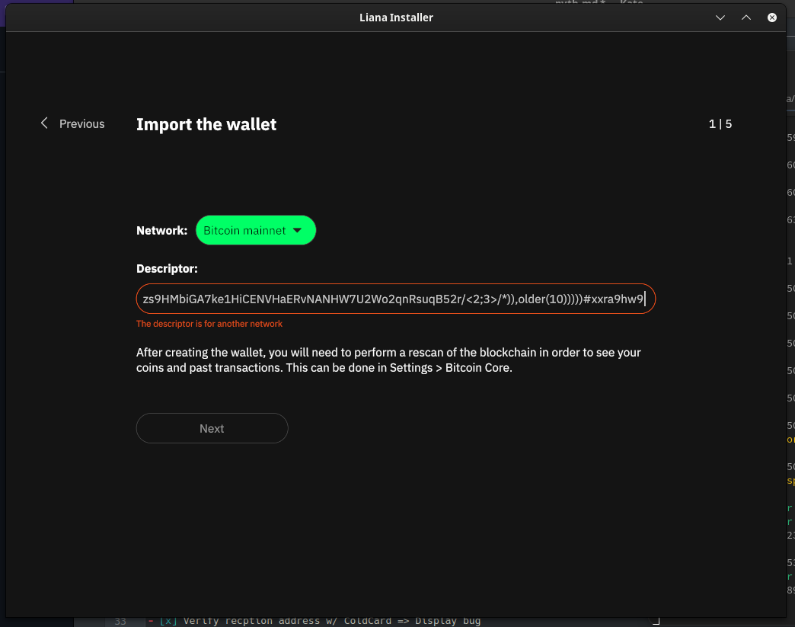

# Template

- [ ] Install Win10
- [ ] Install Debian12
- [ ] Install Ubuntu 22.04/22.10/23.04/23.10
- [ ] Install Arch
- [ ] IBD testnet <platform>
- [ ] IBD Mainnet <platform>

 - [x] Build Debian12
 - [ ] Build Win 10
 - [x] Build MacOS Sonoma

## Upgrade

- [ ] Upgrade from V2
- [ ] Upgrade from V3

## Setup 1 => from zero (Signet Managed by Liana, P2WSH)

- [x] ColdCard(A)
  - [f25bdff6/48'/1'/0'/2']tpubDF8cqMgmJ6BMJwMoEhwAfgVDdXs29y6w2qG1i1ciaYVmqQ6cRTjNoqWJZD2kAR6vJrGcpVBVyYEgYm5GE88F3Z2SVbQxqwdbRZeyUeGwTnk
- [x] Nano S+ (B)
  - [d4ab66f1/48'/1'/0'/2']tpubDEXYN145WM4rVKtcWpySBYiVQ229pmrnyAGJT14BBh2QJr7ABJswchDicZfFaauLyXhDad1nCoCZQEwAW87JPotP93ykC9WJvoASnBjYBxW
- [x] Specter (C)
  - [6abb52a9/48'/1'/0'/2']tpubDFZTCVU1Sa9nJXCxx97UFvGausHQPFjJyaiDbdr8GNqjCLKwYc8ihegK7yJdcizs9HMbiGA7ke1HiCENVHaERvNANHW7U2Wo2qnRsuqB52r

- [x] Generate new wallet multi(3, A, B, C) | multi(2, A, B, C) & 10 blocs
  - wsh(or_i(and_v(v:thresh(3,pkh([f25bdff6/48'/1'/0'/2']tpubDF8cqMgmJ6BMJwMoEhwAfgVDdXs29y6w2qG1i1ciaYVmqQ6cRTjNoqWJZD2kAR6vJrGcpVBVyYEgYm5GE88F3Z2SVbQxqwdbRZeyUeGwTnk/<4;5>/*),a:pkh([d4ab66f1/48'/1'/0'/2']tpubDEXYN145WM4rVKtcWpySBYiVQ229pmrnyAGJT14BBh2QJr7ABJswchDicZfFaauLyXhDad1nCoCZQEwAW87JPotP93ykC9WJvoASnBjYBxW/<4;5>/*),a:pkh([6abb52a9/48'/1'/0'/2']tpubDFZTCVU1Sa9nJXCxx97UFvGausHQPFjJyaiDbdr8GNqjCLKwYc8ihegK7yJdcizs9HMbiGA7ke1HiCENVHaERvNANHW7U2Wo2qnRsuqB52r/<4;5>/*)),older(65535)),or_d(multi(3,[f25bdff6/48'/1'/0'/2']tpubDF8cqMgmJ6BMJwMoEhwAfgVDdXs29y6w2qG1i1ciaYVmqQ6cRTjNoqWJZD2kAR6vJrGcpVBVyYEgYm5GE88F3Z2SVbQxqwdbRZeyUeGwTnk/<0;1>/*,[d4ab66f1/48'/1'/0'/2']tpubDEXYN145WM4rVKtcWpySBYiVQ229pmrnyAGJT14BBh2QJr7ABJswchDicZfFaauLyXhDad1nCoCZQEwAW87JPotP93ykC9WJvoASnBjYBxW/<0;1>/*,[6abb52a9/48'/1'/0'/2']tpubDFZTCVU1Sa9nJXCxx97UFvGausHQPFjJyaiDbdr8GNqjCLKwYc8ihegK7yJdcizs9HMbiGA7ke1HiCENVHaERvNANHW7U2Wo2qnRsuqB52r/<0;1>/*),and_v(v:thresh(2,pkh([f25bdff6/48'/1'/0'/2']tpubDF8cqMgmJ6BMJwMoEhwAfgVDdXs29y6w2qG1i1ciaYVmqQ6cRTjNoqWJZD2kAR6vJrGcpVBVyYEgYm5GE88F3Z2SVbQxqwdbRZeyUeGwTnk/<2;3>/*),a:pkh([d4ab66f1/48'/1'/0'/2']tpubDEXYN145WM4rVKtcWpySBYiVQ229pmrnyAGJT14BBh2QJr7ABJswchDicZfFaauLyXhDad1nCoCZQEwAW87JPotP93ykC9WJvoASnBjYBxW/<2;3>/*),a:pkh([6abb52a9/48'/1'/0'/2']tpubDFZTCVU1Sa9nJXCxx97UFvGausHQPFjJyaiDbdr8GNqjCLKwYc8ihegK7yJdcizs9HMbiGA7ke1HiCENVHaERvNANHW7U2Wo2qnRsuqB52r/<2;3>/*)),older(10)))))#xxra9hw9

- [x] Register on A
- [x] Register on B
- [x] Register on C
- [x] Let Liana handle bitcoind
- [x] Verify recption address w/ specter (QR Code)
- [x] Verify recption address w/ ColdCard => Display bug
- [x] Verify recption address w/ Nano S+

- [x] Receive from P2TR faucet (4 coin, 0 change)
- [x] send back to P2TR faucet (3 coins, 0 change) primary path
- [x] send back to P2TR faucet (3 coins, 0 change) primary path

## Setup 2 Participate mode (liana managed + P2WSH)

### Machine 1 handle A and B using 'participate' mode

  - [x] Nano S+ (C)
  - [x] Share xpub to machine 2
  - [x] Register C on machine 1

### Machine 2 handle C using 'create' mode

- [x] Coldcard (A)
- [x] Specter (B)
- [x] Generate wallet
  -  wsh(or_d(multi(3,[f25bdff6/48'/1'/0'/2']tpubDF8cqMgmJ6BMJwMoEhwAfgVDdXs29y6w2qG1i1ciaYVmqQ6cRTjNoqWJZD2kAR6vJrGcpVBVyYEgYm5GE88F3Z2SVbQxqwdbRZeyUeGwTnk/<0;1>/*,[d4ab66f1/48'/1'/0'/2']tpubDEXYN145WM4rVKtcWpySBYiVQ229pmrnyAGJT14BBh2QJr7ABJswchDicZfFaauLyXhDad1nCoCZQEwAW87JPotP93ykC9WJvoASnBjYBxW/<0;1>/*,[6abb52a9/48'/1'/0'/2']tpubDFZTCVU1Sa9nJXCxx97UFvGausHQPFjJyaiDbdr8GNqjCLKwYc8ihegK7yJdcizs9HMbiGA7ke1HiCENVHaERvNANHW7U2Wo2qnRsuqB52r/<0;1>/*),and_v(v:thresh(2,pkh([f25bdff6/48'/1'/0'/2']tpubDF8cqMgmJ6BMJwMoEhwAfgVDdXs29y6w2qG1i1ciaYVmqQ6cRTjNoqWJZD2kAR6vJrGcpVBVyYEgYm5GE88F3Z2SVbQxqwdbRZeyUeGwTnk/<2;3>/*),a:pkh([d4ab66f1/48'/1'/0'/2']tpubDEXYN145WM4rVKtcWpySBYiVQ229pmrnyAGJT14BBh2QJr7ABJswchDicZfFaauLyXhDad1nCoCZQEwAW87JPotP93ykC9WJvoASnBjYBxW/<2;3>/*),a:pkh([6abb52a9/48'/1'/0'/2']tpubDFZTCVU1Sa9nJXCxx97UFvGausHQPFjJyaiDbdr8GNqjCLKwYc8ihegK7yJdcizs9HMbiGA7ke1HiCENVHaERvNANHW7U2Wo2qnRsuqB52r/<2;3>/*)),older(10))))#cypg8nsf

- [x] Register descriptor A (from settings)
- [x] Register descriptor B (from settings)
- [x] receive coins from faucet wallet
- [x] prepare tx and send to machine 1 (PSBT)
- [x] share descriptor w/ machine 1

### Back to machine 1
- [x] Import descriptor
- [x] Register descriptor on Nano S+
- [x] import and sign PSBT w/ Nano S+
- [x] send back PSBT to machine 2

### Back to machine 2
- [x] Import PSBT
- [x] Sign w/ signer C
- [x] Broadcast

## Setup 3 => Simple taproot

- [x] Nano S (A)
  - [7cab1066/48'/1'/0'/2']tpubDDvqWeedNeqAfoMYPAV5ewJcgQEuuAC9en8UzxZ3PSqiDZcjpLZSXs9yu2S4hYcQb6S7UrSy8eBvk199WgzAsjWmaE8TW87q3riaXfWcRQ6
- [x] Nano S+ (B)
  - [d4ab66f1/48'/1'/0'/2']tpubDEXYN145WM4rVKtcWpySBYiVQ229pmrnyAGJT14BBh2QJr7ABJswchDicZfFaauLyXhDad1nCoCZQEwAW87JPotP93ykC9WJvoASnBjYBxW

- [x] Generate new wallet A | B & 1 blocs
  - tr([7cab1066/48'/1'/0'/2']tpubDDvqWeedNeqAfoMYPAV5ewJcgQEuuAC9en8UzxZ3PSqiDZcjpLZSXs9yu2S4hYcQb6S7UrSy8eBvk199WgzAsjWmaE8TW87q3riaXfWcRQ6/<0;1>/*,and_v(v:pk([d4ab66f1/48'/1'/0'/2']tpubDEXYN145WM4rVKtcWpySBYiVQ229pmrnyAGJT14BBh2QJr7ABJswchDicZfFaauLyXhDad1nCoCZQEwAW87JPotP93ykC9WJvoASnBjYBxW/<0;1>/*),older(1)))#4kuv9k4f

- [x] Register on A
- [x] Register on B
- [x] Let Liana handle bitcoind

- [x] Verify reception address w/ Nano S
- [x] Verify reception address w/ Nano S+

- [x] Receive from faucet (20+ coin, 0 change)
- [x] send back to faucet (6 coins, 1 change) primary path
- [x] send back faucer w/ recovery path

## Setup 4 => Nice taproot
- [x] Nano S+ (A)
  - [d4ab66f1/48'/1'/0'/2']tpubDEXYN145WM4rVKtcWpySBYiVQ229pmrnyAGJT14BBh2QJr7ABJswchDicZfFaauLyXhDad1nCoCZQEwAW87JPotP93ykC9WJvoASnBjYBxW
- [x] Nano S (B)
  - [7cab1066/48'/1'/0'/2']tpubDDvqWeedNeqAfoMYPAV5ewJcgQEuuAC9en8UzxZ3PSqiDZcjpLZSXs9yu2S4hYcQb6S7UrSy8eBvk199WgzAsjWmaE8TW87q3riaXfWcRQ6
- [x] ColdCard(C)
  - [f25bdff6/48'/1'/0'/2']tpubDF8cqMgmJ6BMJwMoEhwAfgVDdXs29y6w2qG1i1ciaYVmqQ6cRTjNoqWJZD2kAR6vJrGcpVBVyYEgYm5GE88F3Z2SVbQxqwdbRZeyUeGwTnk
- [x] Specter (D)
  - [6abb52a9/48'/1'/0'/2']tpubDFZTCVU1Sa9nJXCxx97UFvGausHQPFjJyaiDbdr8GNqjCLKwYc8ihegK7yJdcizs9HMbiGA7ke1HiCENVHaERvNANHW7U2Wo2qnRsuqB52r

- [x] Generate new :
  - path 1 =>  multi(A,B)
  - path 2 => thresh(3, A, B, C, D) + 1
  - path 3 => multi( A, C) + 2
  - path 4 => multi( A, D) + 3
  - path 5 => multi( B, C) + 4
  - path 6 => multi( B, D) + 5
  - path 7 => multi( C, D) + 6
  - path 8 => thresh(1, A, B) + 7
  - path 9 => thresh(1, C, D) + 8

  - tr(tpubD6NzVbkrYhZ4XUnoVEERpwzx116yZF67jDGZJeNt8Cc5WgfY1vZafZx1HoFUutDuiWMuyR5XBg2PSJwzuGUTCmCrwZVPLCWutLfUVcsNPCi/<0;1>/*,{{{{and_v(v:multi_a(3,[d4ab66f1/48'/1'/0'/2']tpubDEXYN145WM4rVKtcWpySBYiVQ229pmrnyAGJT14BBh2QJr7ABJswchDicZfFaauLyXhDad1nCoCZQEwAW87JPotP93ykC9WJvoASnBjYBxW/<2;3>/*,[7cab1066/48'/1'/0'/2']tpubDDvqWeedNeqAfoMYPAV5ewJcgQEuuAC9en8UzxZ3PSqiDZcjpLZSXs9yu2S4hYcQb6S7UrSy8eBvk199WgzAsjWmaE8TW87q3riaXfWcRQ6/<2;3>/*,[f25bdff6/48'/1'/0'/2']tpubDF8cqMgmJ6BMJwMoEhwAfgVDdXs29y6w2qG1i1ciaYVmqQ6cRTjNoqWJZD2kAR6vJrGcpVBVyYEgYm5GE88F3Z2SVbQxqwdbRZeyUeGwTnk/<0;1>/*,[6abb52a9/48'/1'/0'/2']tpubDFZTCVU1Sa9nJXCxx97UFvGausHQPFjJyaiDbdr8GNqjCLKwYc8ihegK7yJdcizs9HMbiGA7ke1HiCENVHaERvNANHW7U2Wo2qnRsuqB52r/<0;1>/*),older(1)),and_v(v:multi_a(2,[d4ab66f1/48'/1'/0'/2']tpubDEXYN145WM4rVKtcWpySBYiVQ229pmrnyAGJT14BBh2QJr7ABJswchDicZfFaauLyXhDad1nCoCZQEwAW87JPotP93ykC9WJvoASnBjYBxW/<4;5>/*,[f25bdff6/48'/1'/0'/2']tpubDF8cqMgmJ6BMJwMoEhwAfgVDdXs29y6w2qG1i1ciaYVmqQ6cRTjNoqWJZD2kAR6vJrGcpVBVyYEgYm5GE88F3Z2SVbQxqwdbRZeyUeGwTnk/<2;3>/*),older(2))},{and_v(v:multi_a(2,[d4ab66f1/48'/1'/0'/2']tpubDEXYN145WM4rVKtcWpySBYiVQ229pmrnyAGJT14BBh2QJr7ABJswchDicZfFaauLyXhDad1nCoCZQEwAW87JPotP93ykC9WJvoASnBjYBxW/<6;7>/*,[6abb52a9/48'/1'/0'/2']tpubDFZTCVU1Sa9nJXCxx97UFvGausHQPFjJyaiDbdr8GNqjCLKwYc8ihegK7yJdcizs9HMbiGA7ke1HiCENVHaERvNANHW7U2Wo2qnRsuqB52r/<2;3>/*),older(3)),and_v(v:multi_a(2,[7cab1066/48'/1'/0'/2']tpubDDvqWeedNeqAfoMYPAV5ewJcgQEuuAC9en8UzxZ3PSqiDZcjpLZSXs9yu2S4hYcQb6S7UrSy8eBvk199WgzAsjWmaE8TW87q3riaXfWcRQ6/<4;5>/*,[f25bdff6/48'/1'/0'/2']tpubDF8cqMgmJ6BMJwMoEhwAfgVDdXs29y6w2qG1i1ciaYVmqQ6cRTjNoqWJZD2kAR6vJrGcpVBVyYEgYm5GE88F3Z2SVbQxqwdbRZeyUeGwTnk/<4;5>/*),older(4))}},{{and_v(v:multi_a(2,[7cab1066/48'/1'/0'/2']tpubDDvqWeedNeqAfoMYPAV5ewJcgQEuuAC9en8UzxZ3PSqiDZcjpLZSXs9yu2S4hYcQb6S7UrSy8eBvk199WgzAsjWmaE8TW87q3riaXfWcRQ6/<6;7>/*,[6abb52a9/48'/1'/0'/2']tpubDFZTCVU1Sa9nJXCxx97UFvGausHQPFjJyaiDbdr8GNqjCLKwYc8ihegK7yJdcizs9HMbiGA7ke1HiCENVHaERvNANHW7U2Wo2qnRsuqB52r/<4;5>/*),older(5)),and_v(v:multi_a(2,[f25bdff6/48'/1'/0'/2']tpubDF8cqMgmJ6BMJwMoEhwAfgVDdXs29y6w2qG1i1ciaYVmqQ6cRTjNoqWJZD2kAR6vJrGcpVBVyYEgYm5GE88F3Z2SVbQxqwdbRZeyUeGwTnk/<6;7>/*,[6abb52a9/48'/1'/0'/2']tpubDFZTCVU1Sa9nJXCxx97UFvGausHQPFjJyaiDbdr8GNqjCLKwYc8ihegK7yJdcizs9HMbiGA7ke1HiCENVHaERvNANHW7U2Wo2qnRsuqB52r/<6;7>/*),older(6))},{and_v(v:multi_a(1,[d4ab66f1/48'/1'/0'/2']tpubDEXYN145WM4rVKtcWpySBYiVQ229pmrnyAGJT14BBh2QJr7ABJswchDicZfFaauLyXhDad1nCoCZQEwAW87JPotP93ykC9WJvoASnBjYBxW/<8;9>/*,[7cab1066/48'/1'/0'/2']tpubDDvqWeedNeqAfoMYPAV5ewJcgQEuuAC9en8UzxZ3PSqiDZcjpLZSXs9yu2S4hYcQb6S7UrSy8eBvk199WgzAsjWmaE8TW87q3riaXfWcRQ6/<8;9>/*),older(7)),and_v(v:multi_a(1,[f25bdff6/48'/1'/0'/2']tpubDF8cqMgmJ6BMJwMoEhwAfgVDdXs29y6w2qG1i1ciaYVmqQ6cRTjNoqWJZD2kAR6vJrGcpVBVyYEgYm5GE88F3Z2SVbQxqwdbRZeyUeGwTnk/<8;9>/*,[6abb52a9/48'/1'/0'/2']tpubDFZTCVU1Sa9nJXCxx97UFvGausHQPFjJyaiDbdr8GNqjCLKwYc8ihegK7yJdcizs9HMbiGA7ke1HiCENVHaERvNANHW7U2Wo2qnRsuqB52r/<8;9>/*),older(8))}}},multi_a(2,[d4ab66f1/48'/1'/0'/2']tpubDEXYN145WM4rVKtcWpySBYiVQ229pmrnyAGJT14BBh2QJr7ABJswchDicZfFaauLyXhDad1nCoCZQEwAW87JPotP93ykC9WJvoASnBjYBxW/<0;1>/*,[7cab1066/48'/1'/0'/2']tpubDDvqWeedNeqAfoMYPAV5ewJcgQEuuAC9en8UzxZ3PSqiDZcjpLZSXs9yu2S4hYcQb6S7UrSy8eBvk199WgzAsjWmaE8TW87q3riaXfWcRQ6/<0;1>/*)})#5uh906kh

- [ ] Register on A
- [ ] Let Liana handle bitcoind

- [ ] Verify reception address w/ Nano S+

- [ ] Receive from faucet (1 coin, 0 change)
- [ ] send back to faucet (1 coins, 1 change) primary path

## Issues

### Successfully checked

- [x] #888/#887 GUI: refresh homepage after broadcasting a transaction / Refresh the state of the wallet after broadcasting a transaction
  - works as expected

- [x] #866 Hint at rescanning when user imports descriptor
  - import a descriptor w/ a coin, the coin appear well on first opening

- [x] #381 Signing fails if another process has an open connection with a Ledger. Maybe have a hint about it in the error?+
  - see 

- [x] #900 GUI: errors when triggering rescan aren't displayed, at all
- [x] #693 Explicit error when trying to rescan past the pruned height
  - see 

- [x] #644/#850 GUI: Signing screen hides detail of transaction/Gui show transaction detail while signing
  - see 

- [x] #580*/#847 Coldcard signing device integration/Add coldcard
  - see Setup 1

- [x] #781 GUI: Installer: clearer error on descriptor import for wrong network
  - see 

- [x] #812 GUi: setup: address & cookie path doesn't update when choosing other network
  - ok

- [x] #903 RBF: warn the user if they are about to shoot them in the foot.
  - see 

- [x] #811 Warn when adding the change output's value to fees.
  - see 

- [x] #934 Panic in installer if user changed network while using managed bitcoind
  - Ok, do not panic now

- [x] #356 Support for rpcuser / rpcpassword instead of cookie file auth for bitcoind RPC

  

  tested w/ both legacy rpc credential and rpcauth

- [ ] #929 [GUI] Use -rpcauth option for Liana-managed bitcoind instead of cookie path

  

### Comments

- [unexpected behaviour] #546 When sending, have a max button to send the whole balance (sweep wallet)

  

  it's not obvious but next button is greyed out

  - as i remember (but cannot reproduce):
    - manually select coins
    - set fee rate
    - input address
    - label
    - select the max checkbox

  

  it's not obvious but next button is greyed out

  here i'm 90% sure the flow (can reproduce only once)
    - Liana just opened
    - max
    - addr
    - label
    - select coin
    - fee

- [to_fix] #991 [GUI] Move qr code to modal
    - taproot truncated address, #1024 already open

- [to_fix] #1017 Updating aliases doesn't record them
    - see [video_record](assets/1017.mp4)

- [to_fix] #861 GUI: RBF: automated labelling?
  - seems that no `rbf` or `cancel` in the label (if a previous label was set):
    - make a spend i labelled 'sparrow' in the send view
    - sign
    - broadcast
    - go to transaction view
    - select tx
    - cancel
    - sign
    - broadcast
    - tx is well replaced but new label is empty

- [?] #791 GUI: Installer: Drop "backup descriptor" step when recovering from descriptor
  - look at `participate` flow:

  

  we still ask user to backup the descriptor he just supply to liana, not sure we should drop this one but want to notice

### To check

- [ ] #826 Let coin selection use (some?) unconfirmed coins

- [ ] try running under windows w/ 30 coins (should freeze?)

- [ ] have a look to #326 GUI: errors about invalid inputs aren't always updated

