# Template

 - [x] Build Arch

 - [x] Build MacOS Sonoma

 - [ ] Build Debian12

 - [x] Build Win 10

## Setup 1 => from zero (Signet Managed by Liana, P2WSH) macOS Sonoma

- [x] Jade (A)
  - bulb moment cry reform bitter virus shadow custom hockey kid delay quantum
  - [8bad162e/48'/1'/0'/2']tpubDDycBkTWNrqFprvKr2mFUJYtSDYHckrhXqv6ckMZKzhTZNgYoTMHaX5oYitKdxXTiYK1BePhKScMYFqR6qR4G3MNnyD35N9xK8kZ7Bo6xxP

- [x] ColdCard(B)
  - uncover library ride voyage nerve hunt share expire wisdom mule omit hint
  - [f25bdff6/48'/1'/0'/2']tpubDF8cqMgmJ6BMJwMoEhwAfgVDdXs29y6w2qG1i1ciaYVmqQ6cRTjNoqWJZD2kAR6vJrGcpVBVyYEgYm5GE88F3Z2SVbQxqwdbRZeyUeGwTnk

- [x] Specter (C)
  - helmet maple gown lounge address umbrella tuition nurse screen gate release rude
  - [d3856607/48'/1'/0'/2']tpubDEe38Mq9U8dKrMRU3cSFD5e66rN8NURiyQdWujzHsUujECMpdVULVyNtoYnzdYGLqWGE1zShTKDokCkmTySFo7FZQ3C82dkF3yZ9NmKF8sN

- [x] Nano S+ (D)
  - video cupboard ketchup sock armed color mobile rhythm marble credit until mosquito
  - [d4ab66f1/48'/1'/0'/2']tpubDEXYN145WM4rVKtcWpySBYiVQ229pmrnyAGJT14BBh2QJr7ABJswchDicZfFaauLyXhDad1nCoCZQEwAW87JPotP93ykC9WJvoASnBjYBxW
  
- [x] Generate new wallet or(and(A,B),or(thresh(3,A,C,D), or(thresh(3,B,C,D),or(thresh(2,A,B,C,D),thresh(1,A,B,C,D)))))
  - 
wsh(or_i(and_v(v:thresh(1,pkh([8bad162e/48'/1'/0'/2']tpubDDycBkTWNrqFprvKr2mFUJYtSDYHckrhXqv6ckMZKzhTZNgYoTMHaX5oYitKdxXTiYK1BePhKScMYFqR6qR4G3MNnyD35N9xK8kZ7Bo6xxP/<6;7>/*),a:pkh([f25bdff6/48'/1'/0'/2']tpubDF8cqMgmJ6BMJwMoEhwAfgVDdXs29y6w2qG1i1ciaYVmqQ6cRTjNoqWJZD2kAR6vJrGcpVBVyYEgYm5GE88F3Z2SVbQxqwdbRZeyUeGwTnk/<4;5>/*),a:pkh([d3856607/48'/1'/0'/2']tpubDEe38Mq9U8dKrMRU3cSFD5e66rN8NURiyQdWujzHsUujECMpdVULVyNtoYnzdYGLqWGE1zShTKDokCkmTySFo7FZQ3C82dkF3yZ9NmKF8sN/<6;7>/*),a:pkh([d4ab66f1/48'/1'/0'/2']tpubDEXYN145WM4rVKtcWpySBYiVQ229pmrnyAGJT14BBh2QJr7ABJswchDicZfFaauLyXhDad1nCoCZQEwAW87JPotP93ykC9WJvoASnBjYBxW/<8;9>/*)),older(20000)),or_i(and_v(v:thresh(2,pkh([8bad162e/48'/1'/0'/2']tpubDDycBkTWNrqFprvKr2mFUJYtSDYHckrhXqv6ckMZKzhTZNgYoTMHaX5oYitKdxXTiYK1BePhKScMYFqR6qR4G3MNnyD35N9xK8kZ7Bo6xxP/<4;5>/*),a:pkh([f25bdff6/48'/1'/0'/2']tpubDF8cqMgmJ6BMJwMoEhwAfgVDdXs29y6w2qG1i1ciaYVmqQ6cRTjNoqWJZD2kAR6vJrGcpVBVyYEgYm5GE88F3Z2SVbQxqwdbRZeyUeGwTnk/<2;3>/*),a:pkh([d3856607/48'/1'/0'/2']tpubDEe38Mq9U8dKrMRU3cSFD5e66rN8NURiyQdWujzHsUujECMpdVULVyNtoYnzdYGLqWGE1zShTKDokCkmTySFo7FZQ3C82dkF3yZ9NmKF8sN/<4;5>/*),a:pkh([d4ab66f1/48'/1'/0'/2']tpubDEXYN145WM4rVKtcWpySBYiVQ229pmrnyAGJT14BBh2QJr7ABJswchDicZfFaauLyXhDad1nCoCZQEwAW87JPotP93ykC9WJvoASnBjYBxW/<6;7>/*)),older(15000)),or_i(and_v(v:thresh(3,pkh([f25bdff6/48'/1'/0'/2']tpubDF8cqMgmJ6BMJwMoEhwAfgVDdXs29y6w2qG1i1ciaYVmqQ6cRTjNoqWJZD2kAR6vJrGcpVBVyYEgYm5GE88F3Z2SVbQxqwdbRZeyUeGwTnk/<0;1>/*),a:pkh([d3856607/48'/1'/0'/2']tpubDEe38Mq9U8dKrMRU3cSFD5e66rN8NURiyQdWujzHsUujECMpdVULVyNtoYnzdYGLqWGE1zShTKDokCkmTySFo7FZQ3C82dkF3yZ9NmKF8sN/<2;3>/*),a:pkh([d4ab66f1/48'/1'/0'/2']tpubDEXYN145WM4rVKtcWpySBYiVQ229pmrnyAGJT14BBh2QJr7ABJswchDicZfFaauLyXhDad1nCoCZQEwAW87JPotP93ykC9WJvoASnBjYBxW/<4;5>/*)),older(10001)),or_d(multi(2,[8bad162e/48'/1'/0'/2']tpubDDycBkTWNrqFprvKr2mFUJYtSDYHckrhXqv6ckMZKzhTZNgYoTMHaX5oYitKdxXTiYK1BePhKScMYFqR6qR4G3MNnyD35N9xK8kZ7Bo6xxP/<0;1>/*,[d4ab66f1/48'/1'/0'/2']tpubDEXYN145WM4rVKtcWpySBYiVQ229pmrnyAGJT14BBh2QJr7ABJswchDicZfFaauLyXhDad1nCoCZQEwAW87JPotP93ykC9WJvoASnBjYBxW/<0;1>/*),and_v(v:thresh(3,pkh([8bad162e/48'/1'/0'/2']tpubDDycBkTWNrqFprvKr2mFUJYtSDYHckrhXqv6ckMZKzhTZNgYoTMHaX5oYitKdxXTiYK1BePhKScMYFqR6qR4G3MNnyD35N9xK8kZ7Bo6xxP/<2;3>/*),a:pkh([d3856607/48'/1'/0'/2']tpubDEe38Mq9U8dKrMRU3cSFD5e66rN8NURiyQdWujzHsUujECMpdVULVyNtoYnzdYGLqWGE1zShTKDokCkmTySFo7FZQ3C82dkF3yZ9NmKF8sN/<0;1>/*),a:pkh([d4ab66f1/48'/1'/0'/2']tpubDEXYN145WM4rVKtcWpySBYiVQ229pmrnyAGJT14BBh2QJr7ABJswchDicZfFaauLyXhDad1nCoCZQEwAW87JPotP93ykC9WJvoASnBjYBxW/<2;3>/*)),older(10000)))))))#mead3p9a

- [failed] Register on A
  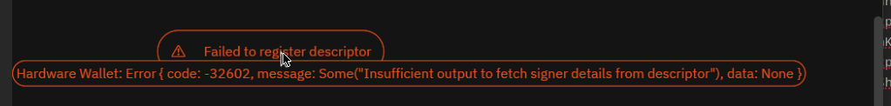
- [x] Register on B
- [failed] Register on C
  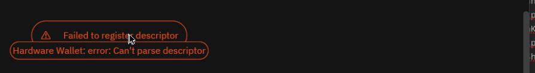
- [failed] Register on D
  

- [x] Generate new wallet or(and(A,B),or(and(thresh(3,A,B,C,D), 10000),or(and(thresh(2,A,B,C,D), 15000),and(thresh(1,A,B,C,D), 2000))))
  - 
wsh(or_i(and_v(v:thresh(1,pkh([8bad162e/48'/1'/0'/2']tpubDDycBkTWNrqFprvKr2mFUJYtSDYHckrhXqv6ckMZKzhTZNgYoTMHaX5oYitKdxXTiYK1BePhKScMYFqR6qR4G3MNnyD35N9xK8kZ7Bo6xxP/<6;7>/*),a:pkh([f25bdff6/48'/1'/0'/2']tpubDF8cqMgmJ6BMJwMoEhwAfgVDdXs29y6w2qG1i1ciaYVmqQ6cRTjNoqWJZD2kAR6vJrGcpVBVyYEgYm5GE88F3Z2SVbQxqwdbRZeyUeGwTnk/<6;7>/*),a:pkh([d3856607/48'/1'/0'/2']tpubDEe38Mq9U8dKrMRU3cSFD5e66rN8NURiyQdWujzHsUujECMpdVULVyNtoYnzdYGLqWGE1zShTKDokCkmTySFo7FZQ3C82dkF3yZ9NmKF8sN/<4;5>/*),a:pkh([d4ab66f1/48'/1'/0'/2']tpubDEXYN145WM4rVKtcWpySBYiVQ229pmrnyAGJT14BBh2QJr7ABJswchDicZfFaauLyXhDad1nCoCZQEwAW87JPotP93ykC9WJvoASnBjYBxW/<4;5>/*)),older(20000)),or_i(and_v(v:thresh(2,pkh([8bad162e/48'/1'/0'/2']tpubDDycBkTWNrqFprvKr2mFUJYtSDYHckrhXqv6ckMZKzhTZNgYoTMHaX5oYitKdxXTiYK1BePhKScMYFqR6qR4G3MNnyD35N9xK8kZ7Bo6xxP/<4;5>/*),a:pkh([f25bdff6/48'/1'/0'/2']tpubDF8cqMgmJ6BMJwMoEhwAfgVDdXs29y6w2qG1i1ciaYVmqQ6cRTjNoqWJZD2kAR6vJrGcpVBVyYEgYm5GE88F3Z2SVbQxqwdbRZeyUeGwTnk/<4;5>/*),a:pkh([d3856607/48'/1'/0'/2']tpubDEe38Mq9U8dKrMRU3cSFD5e66rN8NURiyQdWujzHsUujECMpdVULVyNtoYnzdYGLqWGE1zShTKDokCkmTySFo7FZQ3C82dkF3yZ9NmKF8sN/<2;3>/*),a:pkh([d4ab66f1/48'/1'/0'/2']tpubDEXYN145WM4rVKtcWpySBYiVQ229pmrnyAGJT14BBh2QJr7ABJswchDicZfFaauLyXhDad1nCoCZQEwAW87JPotP93ykC9WJvoASnBjYBxW/<2;3>/*)),older(15000)),or_d(multi(2,[8bad162e/48'/1'/0'/2']tpubDDycBkTWNrqFprvKr2mFUJYtSDYHckrhXqv6ckMZKzhTZNgYoTMHaX5oYitKdxXTiYK1BePhKScMYFqR6qR4G3MNnyD35N9xK8kZ7Bo6xxP/<0;1>/*,[f25bdff6/48'/1'/0'/2']tpubDF8cqMgmJ6BMJwMoEhwAfgVDdXs29y6w2qG1i1ciaYVmqQ6cRTjNoqWJZD2kAR6vJrGcpVBVyYEgYm5GE88F3Z2SVbQxqwdbRZeyUeGwTnk/<0;1>/*),and_v(v:thresh(4,pkh([8bad162e/48'/1'/0'/2']tpubDDycBkTWNrqFprvKr2mFUJYtSDYHckrhXqv6ckMZKzhTZNgYoTMHaX5oYitKdxXTiYK1BePhKScMYFqR6qR4G3MNnyD35N9xK8kZ7Bo6xxP/<2;3>/*),a:pkh([f25bdff6/48'/1'/0'/2']tpubDF8cqMgmJ6BMJwMoEhwAfgVDdXs29y6w2qG1i1ciaYVmqQ6cRTjNoqWJZD2kAR6vJrGcpVBVyYEgYm5GE88F3Z2SVbQxqwdbRZeyUeGwTnk/<2;3>/*),a:pkh([d3856607/48'/1'/0'/2']tpubDEe38Mq9U8dKrMRU3cSFD5e66rN8NURiyQdWujzHsUujECMpdVULVyNtoYnzdYGLqWGE1zShTKDokCkmTySFo7FZQ3C82dkF3yZ9NmKF8sN/<0;1>/*),a:pkh([d4ab66f1/48'/1'/0'/2']tpubDEXYN145WM4rVKtcWpySBYiVQ229pmrnyAGJT14BBh2QJr7ABJswchDicZfFaauLyXhDad1nCoCZQEwAW87JPotP93ykC9WJvoASnBjYBxW/<0;1>/*)),older(10000))))))#3hzp339r

- [x] Register on A
- [x] Register on B
- [failed] Register on C
- [x] Register on D

- [x] Let Liana handle bitcoind
- [no feature] Verify recption address w/ specter (QR Code)
- [x] Verify recption address w/ ColdCard => Display bug
- [x] Verify recption address w/ Nano S+
- [x] Verify recption address w/ Jade

- [x] Receive regtest wallet

- [x] rotate coin
  - [x] Check signing flow w/ Coldcard
    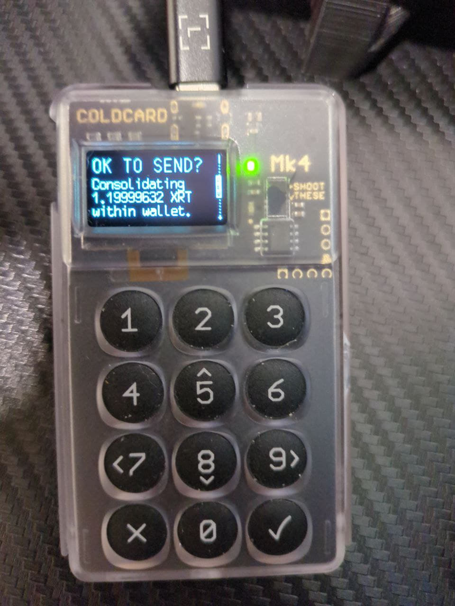
  - [x] Check signing flow w/ Jade
    sending coins to myself, all output displayed 

- [x] recovery sweep
  - [x] Check signing flow w/ Specter
  - [x] Check signing flow w/ Coldcard
  - [x] Check signing flow w/ Nano S+
  - [x] Check signing flow w/ Jade

## Setup 2 Participate mode (liana managed + P2WSH)

### Machine 1 handle Jade and Ledger using 'participate' mode

  - [x] Jade (C)
  - [x] Nano S+ (D)
  - [x] Share xpub to machine 2
  - [x] Register C on machine 1
  - [x] Register D on machine 1

### Machine 2 handle C using 'create' mode

- [x] Coldcard (A)
- [x] Specter (B)
- [x] Generate wallet
  -  

- [x] Register descriptor A (from settings)
- [x] Register descriptor B (from settings)
- [x] receive coins from faucet wallet
- [x] prepare tx and send to machine 1 (PSBT)
- [x] share descriptor w/ machine 1

### Back to machine 1
- [x] Import descriptor
- [x] Register descriptor on Nano S+ and Jade
- [x] import and sign PSBT w/ Nano S+ and Jade
- [x] Broadcast

## Setup 3 => Simple taproot macOS
- [x] Nano S+ (A)
- [x] Nano S+ (B)

- [x] Generate new wallet A | B & 1 blocs
  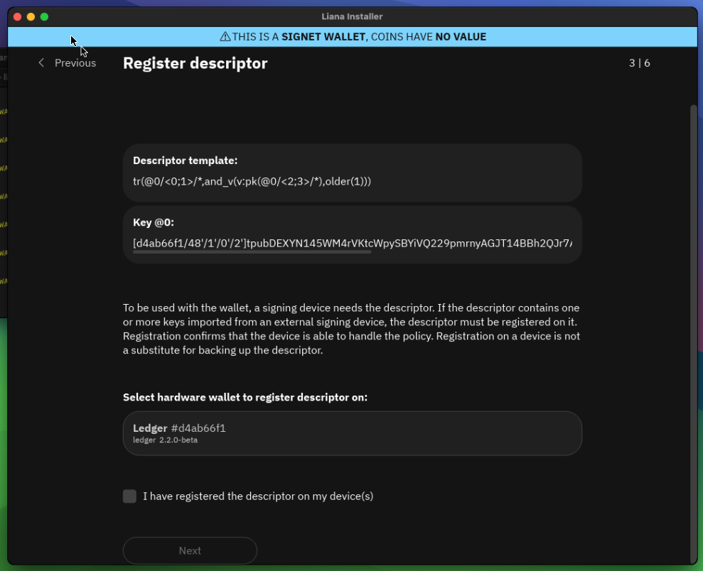

- [x] Register on A
- [x] Let Liana handle bitcoind

- [x] Verify reception address w/ Nano S+

- [x] Receive from faucet 
- [x] send to self w/ recovery path
- [x] send back to faucet

## Setup 4 => Jade addresses

- [x] Jade 
  - bulb moment cry reform bitter virus shadow custom hockey kid delay quantum
  - [8bad162e/48'/1'/0'/2']tpubDDycBkTWNrqFprvKr2mFUJYtSDYHckrhXqv6ckMZKzhTZNgYoTMHaX5oYitKdxXTiYK1BePhKScMYFqR6qR4G3MNnyD35N9xK8kZ7Bo6xxP

- [x] Liana Hot key 
  - impact outer oven early cost radar spend culture stand salon oval badge
  - [20aa8ca2/48'/1'/0'/2']tpubDFS4bQGgvhftuQmUK3JhTbNTfMkBQ8Q1KP63rGzjnrmkieoYyhjLyUnMk3zwUcyH3o8bddGWZo98pcRxf81vXq6mfyiHfU47Bn1dVM9T9bM

- [x] Signet Wallet:
wsh(or_d(multi(2,[8bad162e/48'/1'/0'/2']tpubDDycBkTWNrqFprvKr2mFUJYtSDYHckrhXqv6ckMZKzhTZNgYoTMHaX5oYitKdxXTiYK1BePhKScMYFqR6qR4G3MNnyD35N9xK8kZ7Bo6xxP/<0;1>/*,[20aa8ca2/48'/1'/0'/2']tpubDFS4bQGgvhftuQmUK3JhTbNTfMkBQ8Q1KP63rGzjnrmkieoYyhjLyUnMk3zwUcyH3o8bddGWZo98pcRxf81vXq6mfyiHfU47Bn1dVM9T9bM/<0;1>/*),and_v(v:thresh(1,pkh([8bad162e/48'/1'/0'/2']tpubDDycBkTWNrqFprvKr2mFUJYtSDYHckrhXqv6ckMZKzhTZNgYoTMHaX5oYitKdxXTiYK1BePhKScMYFqR6qR4G3MNnyD35N9xK8kZ7Bo6xxP/<2;3>/*),a:pkh([20aa8ca2/48'/1'/0'/2']tpubDFS4bQGgvhftuQmUK3JhTbNTfMkBQ8Q1KP63rGzjnrmkieoYyhjLyUnMk3zwUcyH3o8bddGWZo98pcRxf81vXq6mfyiHfU47Bn1dVM9T9bM/<2;3>/*)),older(65535))))#35p4jz33

- [x] Register descriptor on Jade

- [x] Fund wallet
 - Txid: 7eb5edbbc1535083b7ed5da12b28b2a4c1fdc53153300246e84136bc7e44d689

- [x] Send to external + 1 change
  - PSBT:
cHNidP8BAH4CAAAAAYnWRH68NkHoRgIwUzHF/cGksigroV3tt4NQU8G77bV+AQAAAAD9////AiChBwAAAAAAF6kU23Nd52zttKPBHOG0u1Z4jxH/2DmHWqAHAAAAAAAiACCkI6OvL8050kIDIGV2ZiZ/TMS3UguAaDNfRHsnnkoNoAAAAAAAAQDqAgAAAAABAfTWim2zwJYwFmmIx5Ft1GuQhpex2wxJL8QKj13blcUnAQAAAAD9////Ap2IHQAAAAAAFgAUgWVhCDDB7YGx5O14QPvV3VEAMytAQg8AAAAAACIAIKMrmH6jH6ewHebBUEfSxAjrZs0zTaT0F7+g6/eLyPxgAkcwRAIgM+krx6AXY9YovmTbQ80b3jkw3wxe+qHUYIkxKXhkLmsCIGzCGIwHw4qi1df1QlDcLYOHh4IJbBnu13GUymYx4otxASECwC5uNGEIZZjCBs3YCb2zGZ7lyAITam0hIvMlMSAvzOOcFgMAAQErQEIPAAAAAAAiACCjK5h+ox+nsB3mwVBH0sQI62bNM02k9Be/oOv3i8j8YAEFhlIhApSdkZs0Rr83s1srWeIPtfNKWeuIRD8XWEvh4Y3Y/lmzIQJ0DcqCX77cOWKdzZK+SJ5BayFLyrB0+1FlYAxxcrGQVFKuc2R2qRRaDOBlF8Wrl2uPzRfzF2OKn+Mkm4isa3apFORw04kaM9O6rrWi1KEkdQQaLkbriKxsk1GIA///ALJoIgYCFscTTQka6qw+UW+K5BQgQxTWsceKzusCahFyLBOqKsgcIKqMojAAAIABAACAAAAAgAIAAIACAAAAAAAAACIGAig0gpTznKqvOPFSNA7RDI3u4aGeGDVFCfdgt98OyikNHIutFi4wAACAAQAAgAAAAIACAACAAgAAAAAAAAAiBgJ0DcqCX77cOWKdzZK+SJ5BayFLyrB0+1FlYAxxcrGQVBwgqoyiMAAAgAEAAIAAAACAAgAAgAAAAAAAAAAAIgYClJ2RmzRGvzezWytZ4g+180pZ64hEPxdYS+Hhjdj+WbMci60WLjAAAIABAACAAAAAgAIAAIAAAAAAAAAAAAAAIgICoD772OuoQP18rljT8uBkXZGa2EGGCIgTARxYlkNQHc0cIKqMojAAAIABAACAAAAAgAIAAIADAAAAAQAAACICAqCjPhl8QQFsKQfu8ivqaOu3q4BUxvGpjgmiQhEvC4b/HIutFi4wAACAAQAAgAAAAIACAACAAQAAAAEAAAAiAgLOV4HNjt/E09d2fUVBhKKBQP+PRESzM0BW8GIqCyhMEBwgqoyiMAAAgAEAAIAAAACAAgAAgAEAAAABAAAAIgIDpaTPOWhG3NEO8rdk4VEf+ZtK3WEBNqEh5fc7plDbFS4ci60WLjAAAIABAACAAAAAgAIAAIADAAAAAQAAAAA=

Comment: both output are displayed on jade, the change should not:

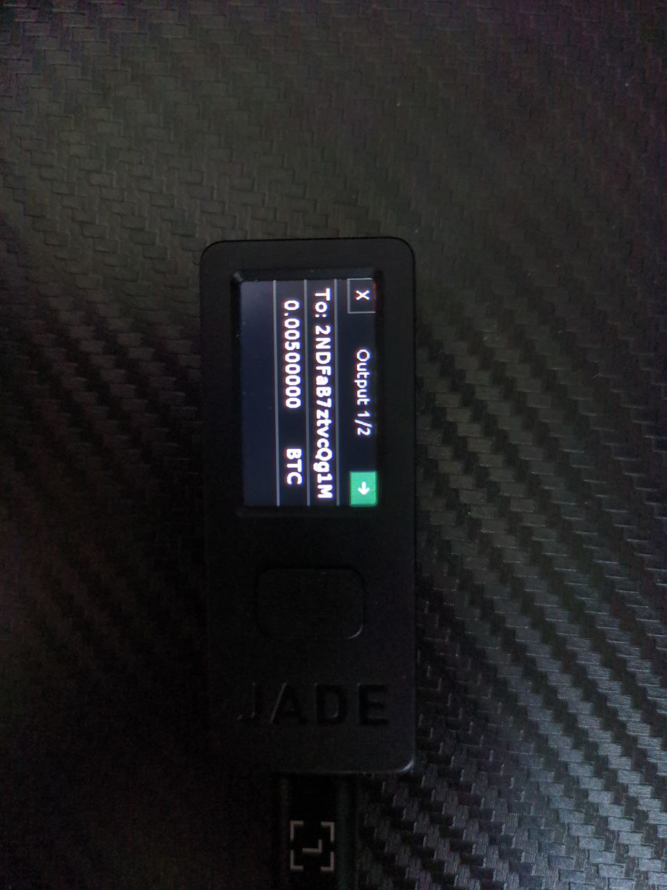

## Issues

### Successfully checked

 - [x] 1026 v5 master branch - addresses don't go away despite being used.

 - [x] 1027 v5 master branch - Transaction labels not refreshed on screen, but updated in db

 - [x] 1039  Hint user if a mainnet wallet already exist and try to create a new one

 - [x] 1059 [Remote bitcoind] wallet name is create in /home/<user>/.liana

 - [x] 1072 build error for wasm compatible example

 - [x] 1087 [GUI] Clicking on "Wallet" breadcrumb in Settings opens "About" page Bug GUI

 - [ ] 1118 Size estimation in the single key primary path case Enhancement

 - [x] 1133 panic if use update feature in spend page w/ an incorrect psb

## Comments

 - Warning on macOS Sonoma, cannot launch Liana:
 
 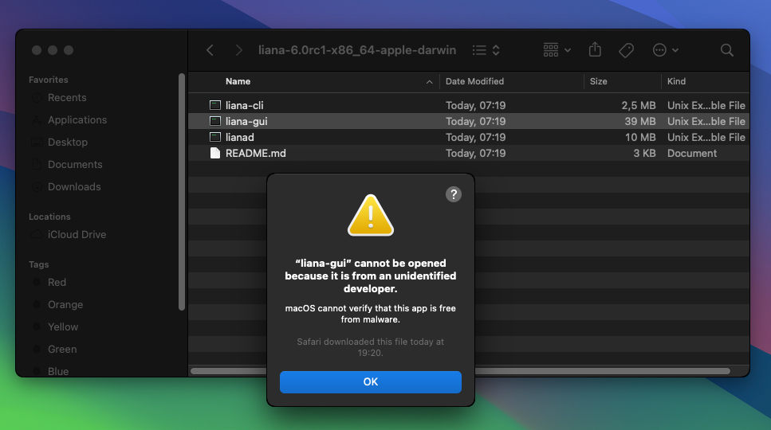
  
  Note: can force execution by these steps:

  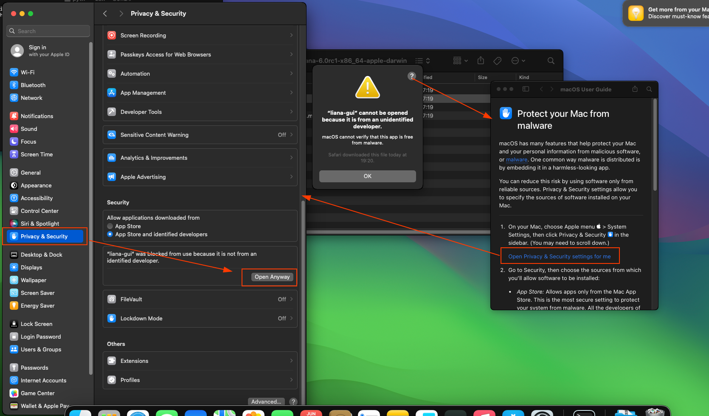

 - A terminal il always opened beside liana

  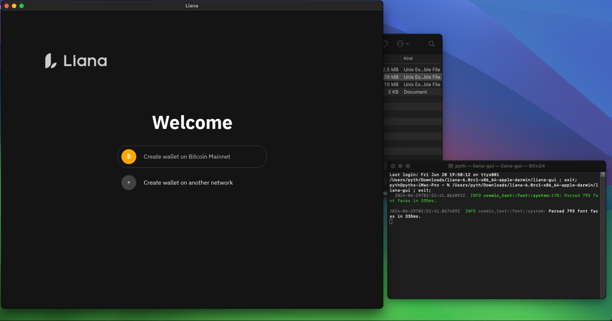

 - Liana Icon does not appear in macOS Dock

 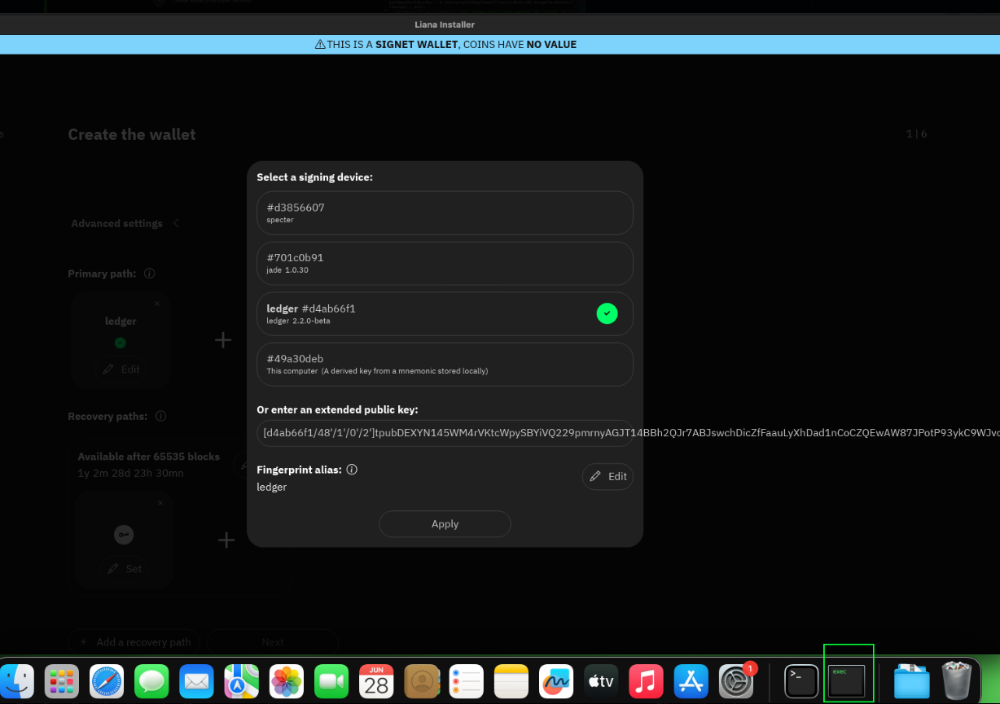

 - Coldcard Mk4 not detected om macOS(VM)

 - Liana is now detected as a `virus` by win10:
 
 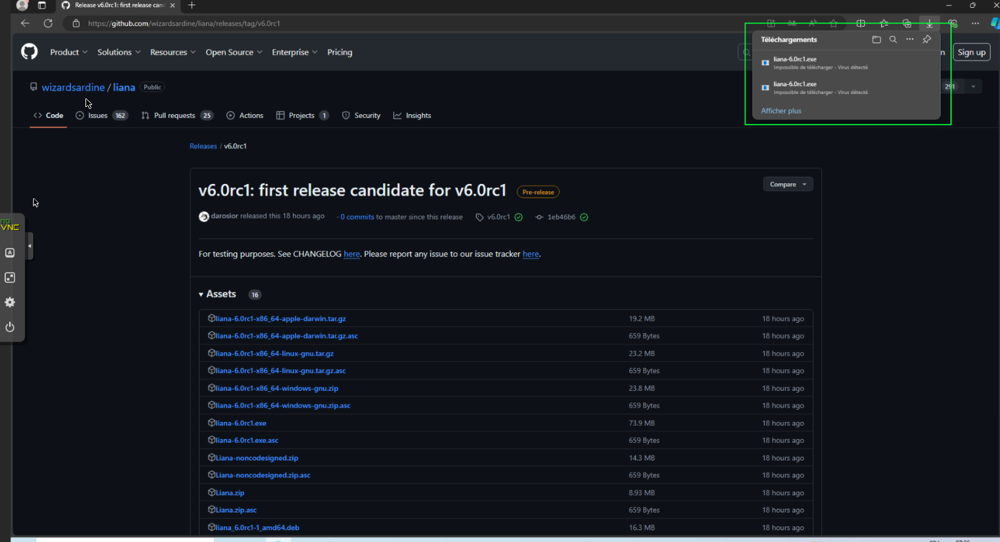

 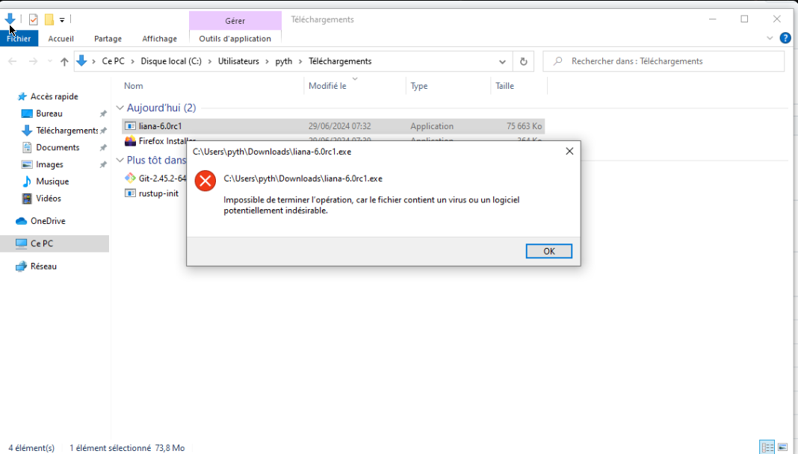

### Related w/ closed issues

### New opened issues/PRs

- 1153 clippyfy macOS/windows

- 1154 xpub url ui glitch => scrollable

- 1155 Specter not detected on windows

- 1156 udev rules (notes)

- 1157 If we register descriptor then edit policy, we cannot register desciptor anymore

- 1158 [Installer] if we move screen back during descriptor registration we get stuck 

- 1159 Download also bitcoin-cli together bitcoind

- 1160 Settings > Bitcoin Core: password should be selectable

- 1161 Display how many blocks remain for recovery

- 1162 Cannot register descriptor from settings w/ Jade

- 1163 Coins selection does not work if only one unconfirmed coin
