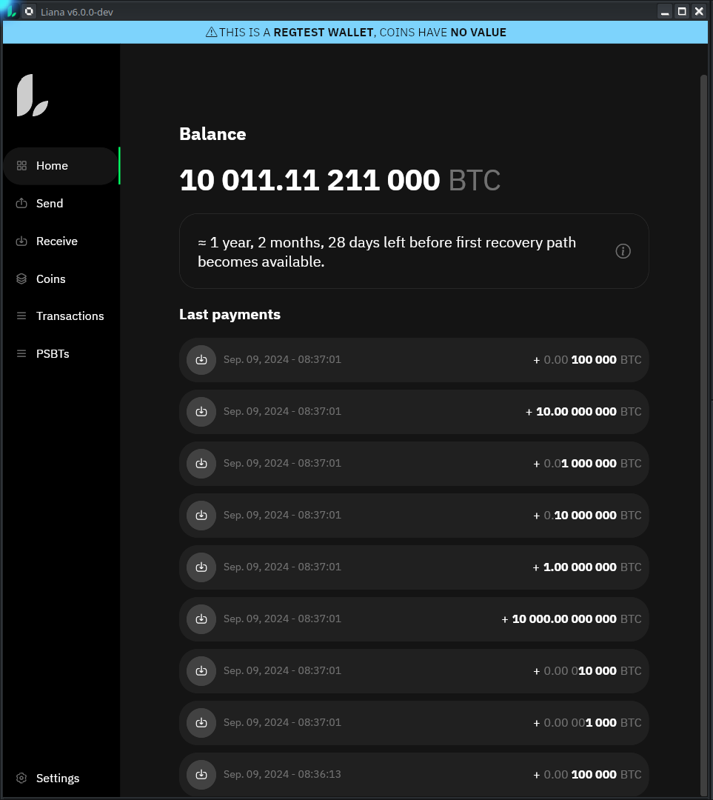
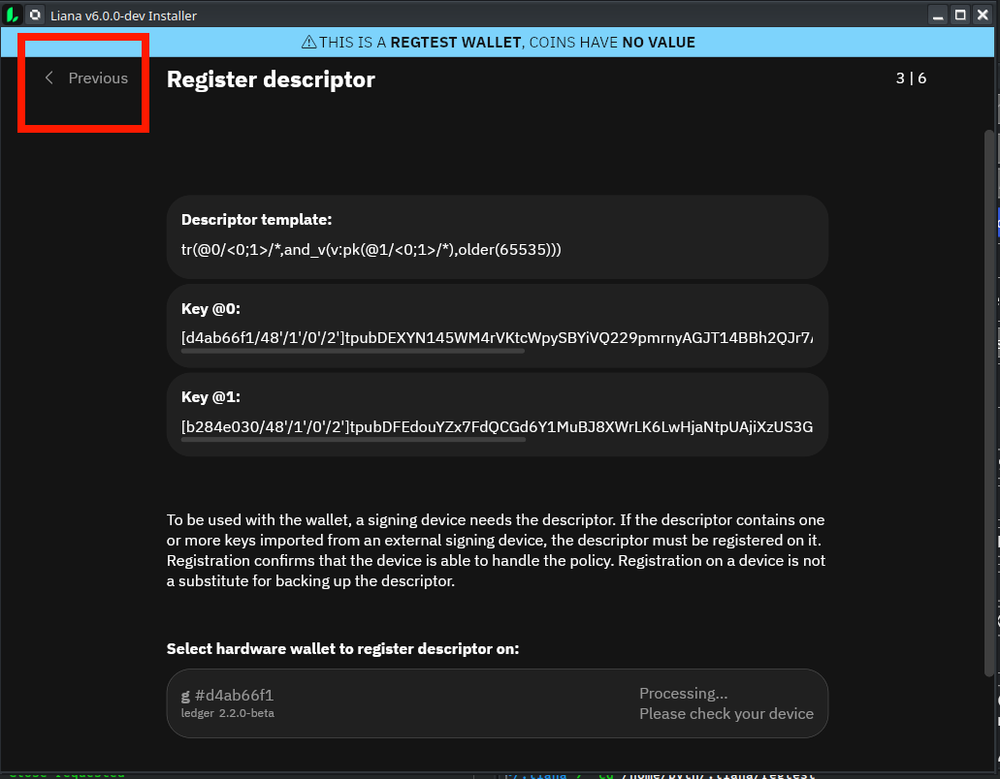
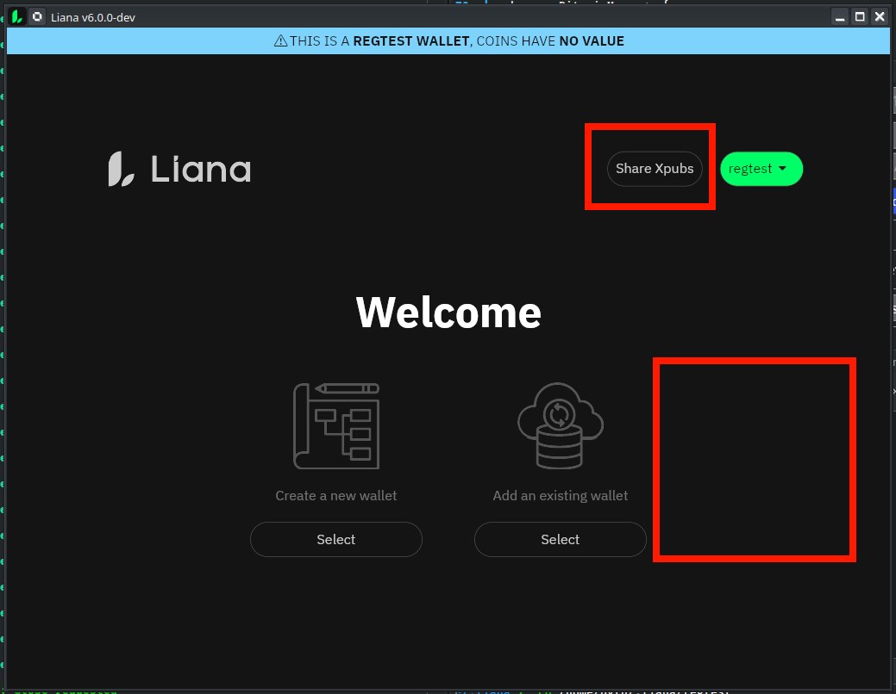
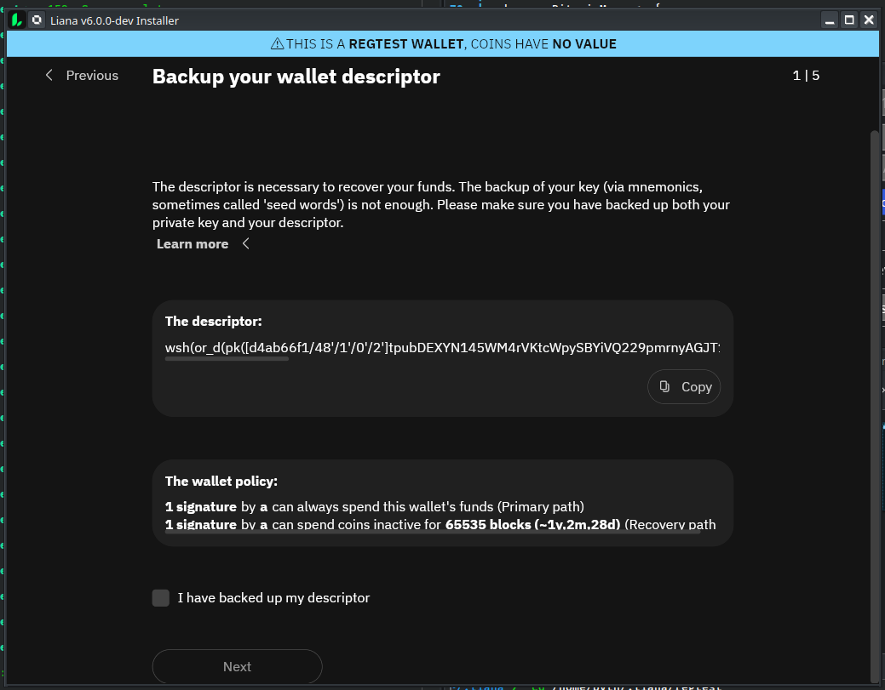
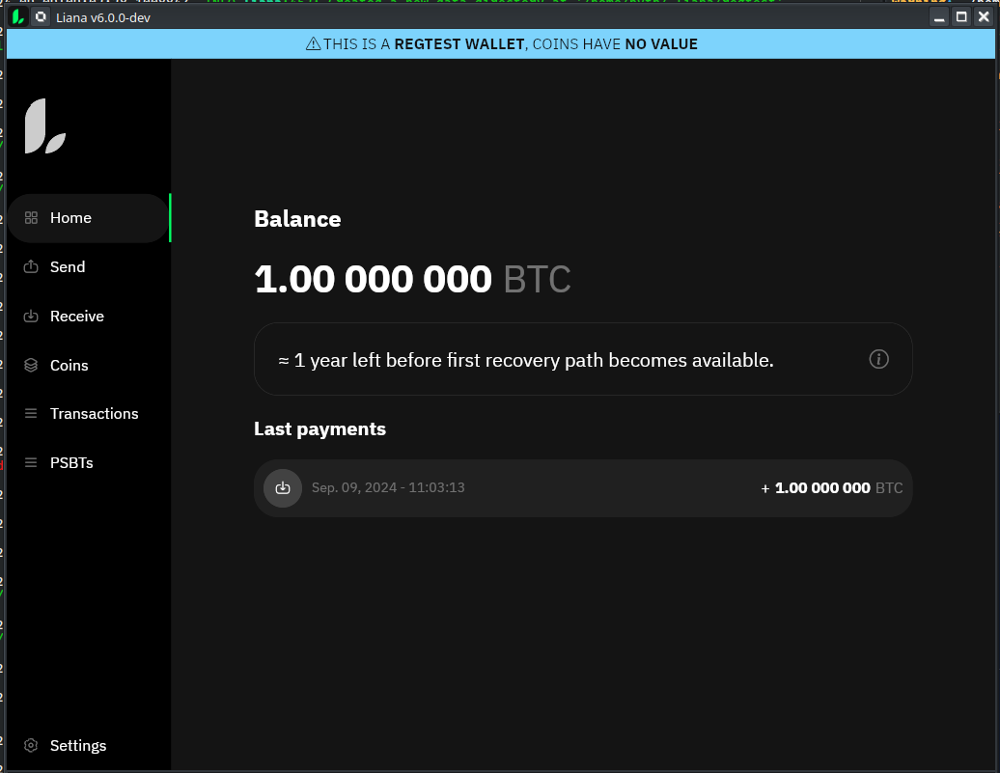
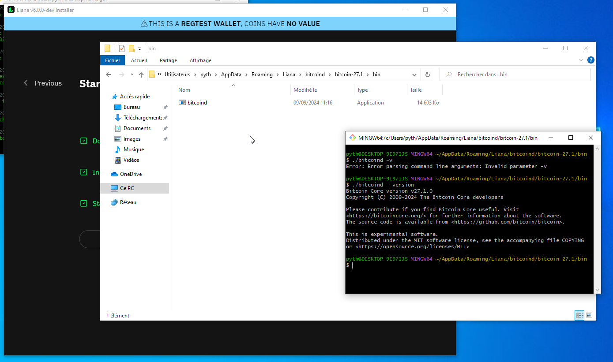
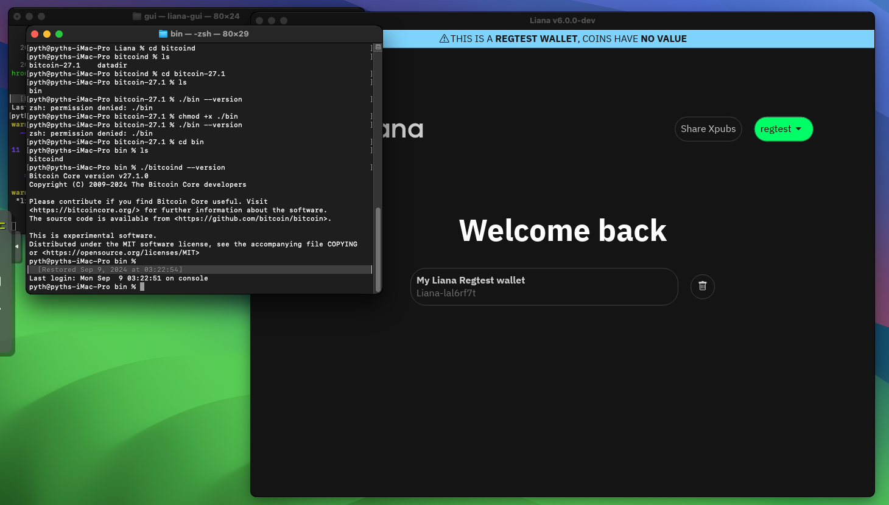
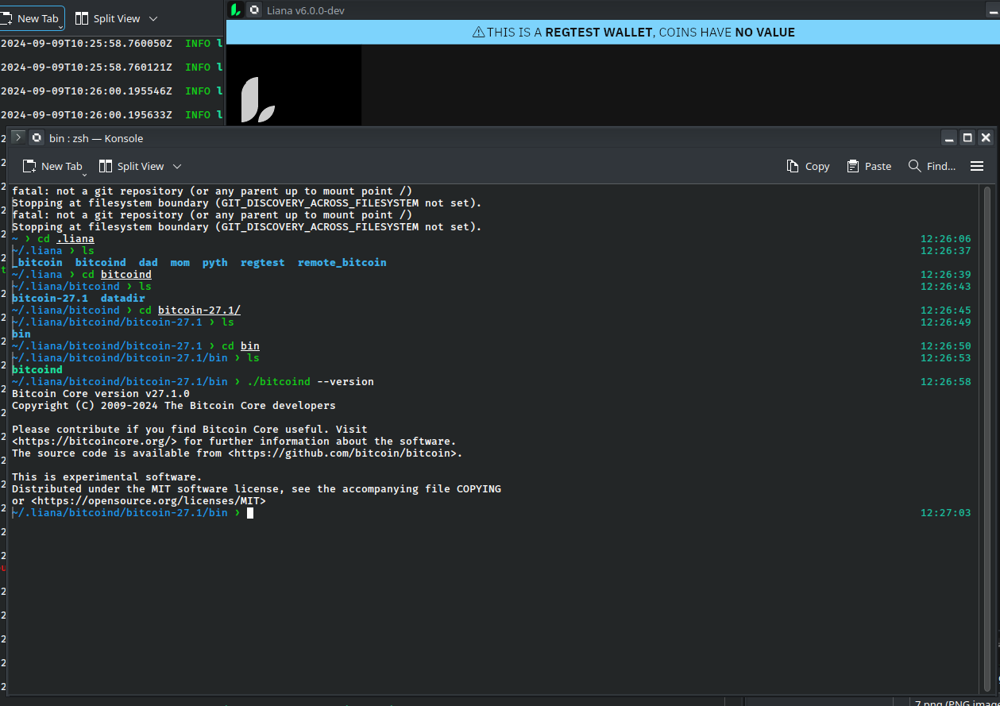
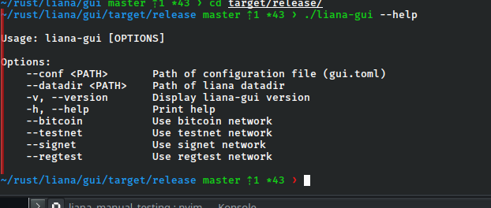

test made on top of #1241 @ 819eb92

# Template

 - [x] Build Arch

 - [x] Build MacOS Sonoma

 - [x] Build Ubuntu 22.04

 - [x] Build Win 10

## Setup 1 => from zero (signet, p2wsh, fulcrum) arch

- [x] Jade (A)
  -  brown coral traffic border reduce doctor boy direct twenty swallow resist elder 
  - [0e266cd1/48'/1'/0'/2']tpubDEFZePEvLmrRCsQu1M1H8RTTrLFBsmvSorPv5n9ybuvc8HcB4LrspavJDbfu5vtZWYfVj356KKFZ77RK6xLPuRTDc1Vv1tYubLAr5qAxozY

- [x] ColdCard(B)
  - give brother mango one arrange dial fetch village draft divert bleak present
  - [fc898399/48'/1'/0'/2']tpubDEEZZ8c3g9DJ55sp2aWHcZT8syRA5d26VZEdjBbVDaPAVJwKnf3cKY53dfnwecTXoLhocpGKzJkRJo1G271JnUnXRoE28Qo2b2pGUFhN1UV

- [x] Specter (C)
  - panut trophy obtain visual moon bench wrong surround pig below lady wife
  - [21068858/48'/1'/0'/2']tpubDEuHFr9qAAhreNDqB6dnUQVQ5xToQrt5s1W8Pduq8ri8Ac5qhyMK4v1a5Wmou7D49SgiGD73MPUBX2RxCsBAkeQaayhRimFiwFREEVrQG6N

- [x] Nano S+ (D)
  - 
  - [d4ab66f1/48'/1'/0'/2']tpubDEXYN145WM4rVKtcWpySBYiVQ229pmrnyAGJT14BBh2QJr7ABJswchDicZfFaauLyXhDad1nCoCZQEwAW87JPotP93ykC9WJvoASnBjYBxW

  
- [x] Generate new wallet or(thresh(4,A,B,C,D,E), and(thresh(2,A,B,C,D,E,F), timelock))
  - wsh(or_d(multi(4,[d4ab66f1/48'/1'/0'/2']tpubDEXYN145WM4rVKtcWpySBYiVQ229pmrnyAGJT14BBh2QJr7ABJswchDicZfFaauLyXhDad1nCoCZQEwAW87JPotP93ykC9WJvoASnBjYBxW/<0;1>/*,[21068858/48'/1'/0'/2']tpubDEuHFr9qAAhreNDqB6dnUQVQ5xToQrt5s1W8Pduq8ri8Ac5qhyMK4v1a5Wmou7D49SgiGD73MPUBX2RxCsBAkeQaayhRimFiwFREEVrQG6N/<0;1>/*,[fc898399/48'/1'/0'/2']tpubDEEZZ8c3g9DJ55sp2aWHcZT8syRA5d26VZEdjBbVDaPAVJwKnf3cKY53dfnwecTXoLhocpGKzJkRJo1G271JnUnXRoE28Qo2b2pGUFhN1UV/<0;1>/*,[0e266cd1/48'/1'/0'/2']tpubDEFZePEvLmrRCsQu1M1H8RTTrLFBsmvSorPv5n9ybuvc8HcB4LrspavJDbfu5vtZWYfVj356KKFZ77RK6xLPuRTDc1Vv1tYubLAr5qAxozY/<0;1>/*),and_v(v:thresh(2,pkh([d4ab66f1/48'/1'/0'/2']tpubDEXYN145WM4rVKtcWpySBYiVQ229pmrnyAGJT14BBh2QJr7ABJswchDicZfFaauLyXhDad1nCoCZQEwAW87JPotP93ykC9WJvoASnBjYBxW/<2;3>/*),a:pkh([21068858/48'/1'/0'/2']tpubDEuHFr9qAAhreNDqB6dnUQVQ5xToQrt5s1W8Pduq8ri8Ac5qhyMK4v1a5Wmou7D49SgiGD73MPUBX2RxCsBAkeQaayhRimFiwFREEVrQG6N/<2;3>/*),a:pkh([fc898399/48'/1'/0'/2']tpubDEEZZ8c3g9DJ55sp2aWHcZT8syRA5d26VZEdjBbVDaPAVJwKnf3cKY53dfnwecTXoLhocpGKzJkRJo1G271JnUnXRoE28Qo2b2pGUFhN1UV/<2;3>/*),a:pkh([0e266cd1/48'/1'/0'/2']tpubDEFZePEvLmrRCsQu1M1H8RTTrLFBsmvSorPv5n9ybuvc8HcB4LrspavJDbfu5vtZWYfVj356KKFZ77RK6xLPuRTDc1Vv1tYubLAr5qAxozY/<2;3>/*)),older(65535))))#tufzy835

- [x] Register on Jade (Installer)
- [x] Register on Coldcard (Installer)
- [x] Register on Specter (Installer)
- [x] Register on Ledger (Installer)

- [x] remove the wallet
- [x] change timelock to 1000 & remove checksum
- [x] import the modified wallet wsh(or_d(multi(4,[d4ab66f1/48'/1'/0'/2']tpubDEXYN145WM4rVKtcWpySBYiVQ229pmrnyAGJT14BBh2QJr7ABJswchDicZfFaauLyXhDad1nCoCZQEwAW87JPotP93ykC9WJvoASnBjYBxW/<0;1>/*,[21068858/48'/1'/0'/2']tpubDEuHFr9qAAhreNDqB6dnUQVQ5xToQrt5s1W8Pduq8ri8Ac5qhyMK4v1a5Wmou7D49SgiGD73MPUBX2RxCsBAkeQaayhRimFiwFREEVrQG6N/<0;1>/*,[fc898399/48'/1'/0'/2']tpubDEEZZ8c3g9DJ55sp2aWHcZT8syRA5d26VZEdjBbVDaPAVJwKnf3cKY53dfnwecTXoLhocpGKzJkRJo1G271JnUnXRoE28Qo2b2pGUFhN1UV/<0;1>/*,[0e266cd1/48'/1'/0'/2']tpubDEFZePEvLmrRCsQu1M1H8RTTrLFBsmvSorPv5n9ybuvc8HcB4LrspavJDbfu5vtZWYfVj356KKFZ77RK6xLPuRTDc1Vv1tYubLAr5qAxozY/<0;1>/*),and_v(v:thresh(2,pkh([d4ab66f1/48'/1'/0'/2']tpubDEXYN145WM4rVKtcWpySBYiVQ229pmrnyAGJT14BBh2QJr7ABJswchDicZfFaauLyXhDad1nCoCZQEwAW87JPotP93ykC9WJvoASnBjYBxW/<2;3>/*),a:pkh([21068858/48'/1'/0'/2']tpubDEuHFr9qAAhreNDqB6dnUQVQ5xToQrt5s1W8Pduq8ri8Ac5qhyMK4v1a5Wmou7D49SgiGD73MPUBX2RxCsBAkeQaayhRimFiwFREEVrQG6N/<2;3>/*),a:pkh([fc898399/48'/1'/0'/2']tpubDEEZZ8c3g9DJ55sp2aWHcZT8syRA5d26VZEdjBbVDaPAVJwKnf3cKY53dfnwecTXoLhocpGKzJkRJo1G271JnUnXRoE28Qo2b2pGUFhN1UV/<2;3>/*),a:pkh([0e266cd1/48'/1'/0'/2']tpubDEFZePEvLmrRCsQu1M1H8RTTrLFBsmvSorPv5n9ybuvc8HcB4LrspavJDbfu5vtZWYfVj356KKFZ77RK6xLPuRTDc1Vv1tYubLAr5qAxozY/<2;3>/*)),older(2000))))#93xlkcrc

- [x] Register on Jade (Installer)
- [x] Register on Coldcard (Installer)
- [x] Register on Specter (Installer)
- [x] Register on Ledger (Installer)

- [camera hs] Verify recption address w/ specter (QR Code)
- [x] Verify recption address w/ ColdCard => Display bug
- [x] Verify recption address w/ Ledger
- [x] Verify recption address w/ Jade

- [x] Receive regtest wallet

- [x] Register on Jade (Settings)
- [x] Register on Coldcard (Settings)
- [x] Register on Specter (Settings)
- [x] Register on Ledger (Settings)

- [x] rotate coin
  - [x] Check signing flow w/ Coldcard
    - [x] appear as slf transfert
  - [x] Check signing flow w/ Jade
    - [x] appear as slf transfert
  - [x] Check signing flow w/ Ledger
    - [x] appear as slf transfert
  - [x] Check signing flow w/ Specter
    - [x] appear as slf transfert

- [x] recovery sweep at 1 sats/vb
  - [x] Check signing flow w/ Specter
  - [x] Check signing flow w/ Coldcard
  - [x] broadcast

- [x] recovery sweep at 10 sats/vb
  - [x] Check signing flow w/ Nano S+
  - [x] Check signing flow w/ Jade
  - [x] broadcast
    - [x] warning about tx replaced
    - [x] tx replaced in mempool & mined

## Setup 2 Participate mode (regtest + fulcrum + taproot)

### Machine 1 (macOS) handle Jade and Ledger using 'participate' mode

  - [x] Ledger (A)
  - [x] Share xpub to machine 2

### Machine 2 (Win10) handle C using 'create' mode

  - [x] Coldcard (B)
  - [x] Register B on machine 2

- [x] Generate wallet or(A, and(B, timelock))
  -  

- [x] Register descriptor B (from settings)
- [x] Receive coins
- [x] go to expiration - 1 block
- [x] renew the coin

- [x] go to expiration + 1 block
- [x] prepare tx and send to machine 1 (PSBT)
- [x] share descriptor w/ machine 1

### Back to machine 1
- [x] Import descriptor
- [x] Register descriptor A (from settings)

- [x] craft recovery tx

- [x] Broadcast

### Labels

- [x] add label from Home > Last payments for a received payment
  - [x] label appear in coins
  - [x] label appear in transactions
  - [x] close and reopen liana, label still there

- [x] edit the label from coins
  - [x] label appear in home -> last payments
  - [x] label appear in transactions
  - [x] close and reopen liana, label still there

- [x] edit the label from transactions
  - [x] label appear in home -> last payments
  - [x] label appear in coins 
  - [x] close and reopen liana, label still there

- [x] add a label on an address
- [x] receive a coin to this address
  - [x] adress label appear in Home -> last payments
  - [x] coins -> select the coins -> address label appear
  - [x] transactions -> select transaction -> click payment -> address label appear
  - [x] close and reopen liana, label still there

### PSBT
- [x] create a spend -> go to sign process -> do NOT sign
- [x] click save
- [x] go to settings
- [x] go to psbts
- [x] the previous saved spend appear

- [x] create a new spend that spend the same coin
- [x] sign it
- [x] go to home
- [x] go to psbt
- [x] the signed psbt is there
- [x] click on it 
- [x] broadcast it
- [x] go to psbt
  - [x] broadcasted psbt is labeled 'Unconfirmed'
  - [x] wait 1 confirmation
  - [x] psbt now labeled 'Spent'
  - [x] previous psbt is labeled 'Deprecated'
  - [x] click on this psbt and delete it

- [x] create a recovery send
  - [x] sign it
  - [x] go to home
  - [x] go to psbts
  - [x] it appear w/ 'Recovery' badge

### Test coin selection

- [x] MAX => should select both confirmed/unconfirmed coins
- [x] unconfirmed coins are not auto selected
- [x] unconfirmed coins can be manually selected

### RBF/CPFP

- [x] RBF
  - [x] send a coin a 1sat/vb
  - [x] tx is unconfirmed
  - [x] go to transactions -> click on unconfirmed tx -> bump fee
  - [x] craft tx + sign + broadcast
  - [x] warning appear at broadcast
  - [x] go to PSBTS -> new tx is 'Unconfirmed', previous one 'Deprecated'
  - [x] mine one block
  - [x] the tx is now not 'Unconfirmed' but 'Spent'

- [x] Cancel
  - [x] send a coin to an external address at 1 sat/vb
  - [x] tx is unconfirmed
  - [x] go to transactions -> click on unconfirmed tx -> cancel
  - [x] craft tx + sign + broadcast
  - [x] warning appear at broadcast
  - [x] go to PSBTs
    - [x] new tx is unconfirmed
    - [fail] canceled tx is deprecated
    - [x] cancceled tx is deprecated after replacement tx is mined

- [x] CPFP
  - [x] send 1 coin to Liana at 1 sat/vb
  - [x] the payment is unconfirmed
  - [x] use this coin for a send to self at 10 sat/vb
  - [fail] fees of CPFP tx should include fee for bump ancestor tx

### Reorg (bitcoind)

- [x] reorg on unconfirmed coin
  - [x] send a coin to the wallet
  - [x] spend to self
  - [x] wait for send to self unconfirmed coin appear in liana
  - [x] invalidate 2 blocks
  - [x] wait for liana block height to be updated
  - [x] the unconfirmed coin should disapear

- [x] reorg on confirmed coin
  - [x] send a coin to the wallet
  - [x] mine one block
  - [x] coin appear confirmed
  - [x] invalidate 2 blocks
  - [x] coin should disapear

### Misc

- [x] change key fingerprint alias
- [x] address index increment
- [x] fee rate at 0 should fail
- [x] fee rate > 1000
- [?] dust input of 1000 sats are alowed
- [x] dust output
- [x] adress validation in spend panel
- [x] descriptor validation in import (installer)
  - [x] wrong network fail
  - [x] no checksum succeed
  - [x] hardened multipath fail
  - [x] no multipath fail
  - [x] cannot import non liana descriptor

### Electrum
- [x] electrs
- [x] esplora
- [x] electrumx
- [x] fulcrum
- [x] ssl (ssl://pythcoiner.dev:50002)

### WS Backend

- [x] create custom wallet on desktop
- [x] create a liana lite account + wallet & import in desktop
- [x] join a wallet by invitation

### DB upgrade

## Issues

### Successfully checked

- [x] #1182 add space separator to btc amount
  

- [x] #1189 reset signing device registration if descriptor change

- [x] #1190 disable previous button if device processing
  

- [x] #1193 coldcard taproot

- [x] #1139 specter diy taproot

- [x] #1199 remove participate flow
- [x] #1211 add share xpub
  

- [x] #1236 display descriptor policy in installer
  

- [x] #1226 fix remaining time when close to 1 year
  

- [x] #1205 bump bitcoind to 27.1
  
  
  

- [ ] #1092 randomized anti-fee snipping
- [x] #1231 min window height
- [x] #1183 improve descriptor validation
- [x] #1214 add version in the title bar
  ![./assets/10.png]

- [x] #1212 change multipath not hardened
  ![./assets/9.png]

- [ ] #1192 text overlap
  ![./assets/11.png]

- [x] #1167 fix on next button
- [x] #1174 fix on psbt labels
- [x] #1170 values in wallet settings
- [x] #1190 disable prev button if descriptor validation ongoing
- [x] #1189 reset signing device registartion state if descriptor change
- [x] #1186 add minimum feerate in feerate error
- [x] #1073 add -h/--help args to gui
  

## Comments

### Related w/ closed issues

### New opened issues/PRs

