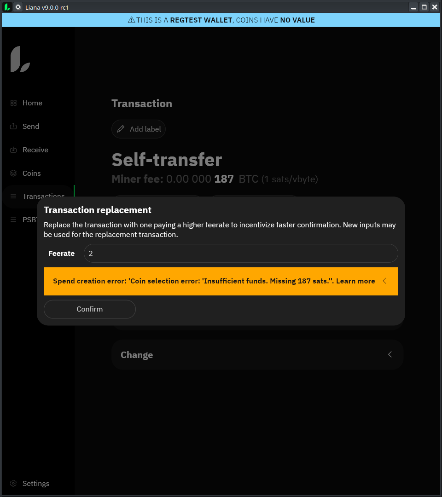
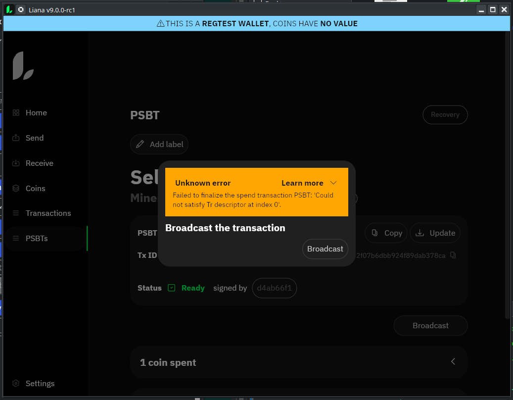

test made on top of v9rc1

 - [x] Build Arch

## get binary

- [x] download from github liana-9.0-rc1-x86_64-linux-gnu.tar.gz
- [x] check signature
- [x] check binary version w/ `liana-gui --version ` => 9.0.0-rc1
- [x] check version in launcher => 9.0.0-rc1
- [x] check version in installer title bar => 9.0.0-rc1 Installer
- [x] check version in gui title bar => 9.0.0-rc1

## Setup 1 => maxi wallet (local unmanaged bitcoind regtest) 

- [x] ColdCard(A)
  - c658b283

- [x] BitBox02(B)
  - e2e975b7

- [x] Nano S+ (C)
  - d4ab66f1

- [x] Generate new wallet tr( A & B & C | A & B & 1 block | A & C & 2 blocks | B & C & 3 blocks | A & 4 blocks | B & 5 blocks | C & 6 blocks)
  - tr(tpubD6NzVbkrYhZ4Wtfo1579sazwsSBVhtY4yCGXy3F4KTm2d1Qnkh2uYJFX3QtPSDpz38GBAZVpDPJoZW9Bqovoz3qBXY8HZPXorn3kmR4TWuG/<0;1>/*,{{{and_v(v:pk([e2e975b7/48'/1'/0'/2']tpubDFkztzafRmw9sd9V2jwgiv5eafAAZmfQX5huqBLzbfFcNUzkCCWN2kpYHkjhzWvwrQuckyxmruVka7DWtzNRPy4Bpgty4vr9Sx6U5QmhGrw/<6;7>/*),older(5)),and_v(v:pk([d4ab66f1/48'/1'/0'/2']tpubDEXYN145WM4rVKtcWpySBYiVQ229pmrnyAGJT14BBh2QJr7ABJswchDicZfFaauLyXhDad1nCoCZQEwAW87JPotP93ykC9WJvoASnBjYBxW/<6;7>/*),older(6))},{{and_v(v:multi_a(2,[c658b283/48'/1'/0'/2']tpubDFL5wzgPBYK5pZ2Kh1T8qrxnp43kjE5CXfguZHHBrZSWpkfASy5rVfj7prh11XdqkC1P3kRwUPBeX7AHN8XBNx8UwiprnFnEm5jyswiRD4p/<2;3>/*,[e2e975b7/48'/1'/0'/2']tpubDFkztzafRmw9sd9V2jwgiv5eafAAZmfQX5huqBLzbfFcNUzkCCWN2kpYHkjhzWvwrQuckyxmruVka7DWtzNRPy4Bpgty4vr9Sx6U5QmhGrw/<2;3>/*),older(1)),and_v(v:multi_a(2,[c658b283/48'/1'/0'/2']tpubDFL5wzgPBYK5pZ2Kh1T8qrxnp43kjE5CXfguZHHBrZSWpkfASy5rVfj7prh11XdqkC1P3kRwUPBeX7AHN8XBNx8UwiprnFnEm5jyswiRD4p/<4;5>/*,[d4ab66f1/48'/1'/0'/2']tpubDEXYN145WM4rVKtcWpySBYiVQ229pmrnyAGJT14BBh2QJr7ABJswchDicZfFaauLyXhDad1nCoCZQEwAW87JPotP93ykC9WJvoASnBjYBxW/<2;3>/*),older(2))},{and_v(v:multi_a(2,[e2e975b7/48'/1'/0'/2']tpubDFkztzafRmw9sd9V2jwgiv5eafAAZmfQX5huqBLzbfFcNUzkCCWN2kpYHkjhzWvwrQuckyxmruVka7DWtzNRPy4Bpgty4vr9Sx6U5QmhGrw/<4;5>/*,[d4ab66f1/48'/1'/0'/2']tpubDEXYN145WM4rVKtcWpySBYiVQ229pmrnyAGJT14BBh2QJr7ABJswchDicZfFaauLyXhDad1nCoCZQEwAW87JPotP93ykC9WJvoASnBjYBxW/<4;5>/*),older(3)),and_v(v:pk([c658b283/48'/1'/0'/2']tpubDFL5wzgPBYK5pZ2Kh1T8qrxnp43kjE5CXfguZHHBrZSWpkfASy5rVfj7prh11XdqkC1P3kRwUPBeX7AHN8XBNx8UwiprnFnEm5jyswiRD4p/<6;7>/*),older(4))}}},multi_a(3,[c658b283/48'/1'/0'/2']tpubDFL5wzgPBYK5pZ2Kh1T8qrxnp43kjE5CXfguZHHBrZSWpkfASy5rVfj7prh11XdqkC1P3kRwUPBeX7AHN8XBNx8UwiprnFnEm5jyswiRD4p/<0;1>/*,[e2e975b7/48'/1'/0'/2']tpubDFkztzafRmw9sd9V2jwgiv5eafAAZmfQX5huqBLzbfFcNUzkCCWN2kpYHkjhzWvwrQuckyxmruVka7DWtzNRPy4Bpgty4vr9Sx6U5QmhGrw/<0;1>/*,[d4ab66f1/48'/1'/0'/2']tpubDEXYN145WM4rVKtcWpySBYiVQ229pmrnyAGJT14BBh2QJr7ABJswchDicZfFaauLyXhDad1nCoCZQEwAW87JPotP93ykC9WJvoASnBjYBxW/<0;1>/*)})#k2m7cy9v

- [x] close liana here
- [x] import the descriptor

- [x] Register on Coldcard (Installer)
  - [x] provably unspendable key tagged
  - [fail] our key tagged
- [x] Register on Bitbox (Installer)
  - [x] provably unspendable key tagged
  - [x] our key tagged
- [x] Register on Ledger (Installer)
  - [not on 2.2.0-beta] provably unspendable key tagged
  - [x] our key tagged

- [x] Verify reception address w/ Bitbox02
  - [testnet] display address
  - [no] display index
- [x] Verify reception address w/ ColdCard
  - [testnet] display address
  - [x] display index
- [x] Verify reception address w/ Ledger
  - [testnet] display address
  - [no] display index

- [x] Receive regtest wallet

- [x] remove wallet
- [x] import wallet

- [x] rescan

- [x] Register on Coldcard (Settings)
- [cannot remove descriptor] Register on Bitbox02 (Settings)
- [x] Register on Ledger (Settings)

- [ ] rotate coin
  - [x] click refresh button in home panel
  - [x] Check signing flow w/ Coldcard
    - [x] appear as self transfert
  - [x] Check signing flow w/ Bitbox
    - [x] appear as self transfert
  - [x] Check signing flow w/ Ledger
    - [x] appear as self transfert

- [x] recovery sweep at 1 sats/vb
  - [x] Check signing flow w/ Coldcard
  - [x] Check signing flow w/ BitBox02
  - [x] broadcast

- [fail] recovery sweep at 10 sats/vb
  a recovery cannot be bumped:
  
  - [ ] broadcast
    - [ ] warning about tx replaced
    - [ ] tx replaced in mempool & mined

## Setup 2 Inheritance regtest external electrs

- [x] ColdCard(A)
  - c658b283

- [x] BitBox02(B)
  - e2e975b7

- [x] Generate new wallet 
  - wsh(or_d(pk([c658b283/48'/1'/0'/2']tpubDFL5wzgPBYK5pZ2Kh1T8qrxnp43kjE5CXfguZHHBrZSWpkfASy5rVfj7prh11XdqkC1P3kRwUPBeX7AHN8XBNx8UwiprnFnEm5jyswiRD4p/<0;1>/*),and_v(v:pkh([e2e975b7/48'/1'/0'/2']tpubDFkztzafRmw9sd9V2jwgiv5eafAAZmfQX5huqBLzbfFcNUzkCCWN2kpYHkjhzWvwrQuckyxmruVka7DWtzNRPy4Bpgty4vr9Sx6U5QmhGrw/<0;1>/*),older(1))))#30srgfs7

- [x] Register on Coldcard (Installer)
- [x] Register on Bitbox (Installer)

- [x] Receive regtest wallet

- [x] spend coin
  - [x] Check signing flow w/ Coldcard
  - [x] broadcast

- [x] bump fee 10 sats/vb
  - [x] broadcast
  - [x] warning about tx replaced
  - [x] tx replaced in mempool & mined

- [x] cancel tx
  - [x] broadcast
  - [x] warning about tx replaced
  - [x] generate block
  - [x] tx replaced in mempool & mined

- [x] recovery sweep at 1 sats/vb
  - [x] Check signing flow w/ BitBox02
  - [x] broadcast

- [x] export transactions

## Setup 3 Multisig template WS backend signet segwit on 2 machines

- [x] ColdCard(A) Machine 1
  - c658b283

- [x] Nano S+ (B) Machine 2
  - d4ab66f1

- [x] Bitbox (C) Machine 1
  - e2e975b7

- [x] Generate new wallet tr(A & B | thresh(2,A,B,C) & 1 block)
  - wsh(or_d(multi(2,[c658b283/48'/1'/0'/2']tpubDFL5wzgPBYK5pZ2Kh1T8qrxnp43kjE5CXfguZHHBrZSWpkfASy5rVfj7prh11XdqkC1P3kRwUPBeX7AHN8XBNx8UwiprnFnEm5jyswiRD4p/<0;1>/*,[d4ab66f1/48'/1'/0'/2']tpubDEXYN145WM4rVKtcWpySBYiVQ229pmrnyAGJT14BBh2QJr7ABJswchDicZfFaauLyXhDad1nCoCZQEwAW87JPotP93ykC9WJvoASnBjYBxW/<0;1>/*),and_v(v:thresh(2,pkh([c658b283/48'/1'/0'/2']tpubDFL5wzgPBYK5pZ2Kh1T8qrxnp43kjE5CXfguZHHBrZSWpkfASy5rVfj7prh11XdqkC1P3kRwUPBeX7AHN8XBNx8UwiprnFnEm5jyswiRD4p/<2;3>/*),a:pkh([d4ab66f1/48'/1'/0'/2']tpubDEXYN145WM4rVKtcWpySBYiVQ229pmrnyAGJT14BBh2QJr7ABJswchDicZfFaauLyXhDad1nCoCZQEwAW87JPotP93ykC9WJvoASnBjYBxW/<2;3>/*),a:pkh([e2e975b7/48'/1'/0'/2']tpubDFkztzafRmw9sd9V2jwgiv5eafAAZmfQX5huqBLzbfFcNUzkCCWN2kpYHkjhzWvwrQuckyxmruVka7DWtzNRPy4Bpgty4vr9Sx6U5QmhGrw/<0;1>/*)),older(1))))#47j2yqvv

- [x] Register on Coldcard (Installer)
- [x] Register on Bitbox (Installer)

- [x] Use liana connect

- [x] Receive wallet

- [x] spend coin to self
  - [x] Check signing flow w/ Coldcard Machine A
  - [x] Check signing flow w/ Ledger B

- [ ] recovery sweep at 1 sats/vb Machine A + Machine B
  - [ ] Check signing flow w/ BitBox02
  - [ ] Check signing flow w/ Ledger
  - <!-- do not broadcast -->

## Setup 4 Jean Do issue w/ krux
<!-- https://gist.github.com/jdlcdl/7abcf914ab472c1269d36f9347fcfe2d -->

 issue hit while testing `Setup 1` and recovery w/ only Ledger:



### PSBT before signing

```
cHNidP8BAF4CAAAAAULpuJ8xkOVUS9hvje2XdQ7TKUd8di0B7gTClywEMZugAAAAAAAGAAAAAUPY9QUAAAAAIlEgb466Mi1Rat2j0ZD9+waq5zdpLthfeQ4IWyqZ5Aiu+UPsEQAAAAEBK/7Y9QUAAAAAIlEgbJJVgiIzcm1JhQ4+bW/fqWrnhrE912XV2Mx9lIo46CmCFcAwyvEuP5/MpvrWs9Demsq673UNFeUM9Yk7KLMmbenVAAy/5bDeBa9cIb6MsJEPTSYd4VTJ4E+ySL16QYA6px53jz4Ivorhm5+laZOrbVY8xbo+YyzA0FONGK2S+dYjvHXQyD4SJGvVj8J/O0kEUwJzPOGPxYqWKXTJo1PM5stcrCUgxgrOsyG9DHfEa5FlipyE3xHOz4yezLVmyW59s3GGvFqtVrLAQhXAMMrxLj+fzKb61rPQ3prKuu91DRXlDPWJOyizJm3p1QBkkl2/QJV0fVhNrs6pU+y45X5i1dTehpVFbPlcNyBkpWkgme9fl+U2TTXUj3sCgCuK4DXtMdv6Tq6r7Kp92mYXFJqsINd18kBYHYP+v0PXBAnfMhmuvyoSxu7XzLeikwfQFxPyuiCsKEtb+cQcXv59UmxMDSkPtiM2SFA25jtH0WBJR2HWgrpTnMCiFcAwyvEuP5/MpvrWs9Demsq673UNFeUM9Yk7KLMmbenVAHYGXcWuPRFJVeT5fX2VJXVgxz0kSLPLd0uQk3Rvp49Ut0GvDhZmobwHdHHhuySijtnyvYhPd5qAw65b67oYNa9UoegH9vamuTJvrfkeHzUy2B1yXko6DX4ZpqVC/GjlH9DIPhIka9WPwn87SQRTAnM84Y/FipYpdMmjU8zmy1ysSSC0CJkQ/g6XQ/OjELt64RnXIS/1SnBDitjGnaYGWThXkKwgR2IQjBiLTblBMAT/NcgWknlvjgYSJIfO2hklG9p5fo26Up1TssCCFcAwyvEuP5/MpvrWs9Demsq673UNFeUM9Yk7KLMmbenVAKU7wpt3n1zLZQO8KIcxv6MiiT6f/rzcVIH9FEOqcxlqjz4Ivorhm5+laZOrbVY8xbo+YyzA0FONGK2S+dYjvHXQyD4SJGvVj8J/O0kEUwJzPOGPxYqWKXTJo1PM5stcrCUgO/8s+38aHtam/FAjj631y2mBeHBE4MzY8Lnle8a5tN2tVbLAohXAMMrxLj+fzKb61rPQ3prKuu91DRXlDPWJOyizJm3p1QC0aq75LBoZJBRGCBMaYskcb8iFfFu/TqL6Lc+mXwn+lenZFEPpJ/kxs10thnVeUS23NzzZ4Ru559n3Cepc27XIVKHoB/b2prkyb635Hh81Mtgdcl5KOg1+GaalQvxo5R/QyD4SJGvVj8J/O0kEUwJzPOGPxYqWKXTJo1PM5stcrEkgTIx8vG+nnVzu+PiGSwQDFBQtlgozmDUyCUlxHlkooHusIFylkXhvxy1Xwq720EzQA8kbniWIYPX+iC8biMhUTkuRulKdUrLAohXAMMrxLj+fzKb61rPQ3prKuu91DRXlDPWJOyizJm3p1QC+742nKfNQbjQmOeL8Yz7TkUUBeKaQNXhVL3TwAE4X/bdBrw4WZqG8B3Rx4bskoo7Z8r2IT3eagMOuW+u6GDWvVKHoB/b2prkyb635Hh81Mtgdcl5KOg1+GaalQvxo5R/QyD4SJGvVj8J/O0kEUwJzPOGPxYqWKXTJo1PM5stcrCUgXlQSVv6/FwiCv+45FBuJCMMwyWtM9GDb8emUwfKXWeutVLLAohXAMMrxLj+fzKb61rPQ3prKuu91DRXlDPWJOyizJm3p1QDV4f62vhiW1UFatMN8IsbbJkz1fhfpmiatxr7EhTR52unZFEPpJ/kxs10thnVeUS23NzzZ4Ru559n3Cepc27XIVKHoB/b2prkyb635Hh81Mtgdcl5KOg1+GaalQvxo5R/QyD4SJGvVj8J/O0kEUwJzPOGPxYqWKXTJo1PM5stcrEkgng3IoyRjtupCekI5nNqBzGGX7Moz/uVjlhEOcILfj2usIIN4NCyarefoHLA13gPIZv8g/jGxMLrpKfiko3pd7HznulKdUbLAIRYwyvEuP5/MpvrWs9Demsq673UNFeUM9Yk7KLMmbenVAA0AfEYeXQAAAAABAAAAIRY7/yz7fxoe1qb8UCOPrfXLaYF4cETgzNjwueV7xrm03T0BDL/lsN4Fr1whvoywkQ9NJh3hVMngT7JIvXpBgDqnHnfi6XW3MAAAgAEAAIAAAACAAgAAgAYAAAABAAAAIRZHYhCMGItNuUEwBP81yBaSeW+OBhIkh87aGSUb2nl+jT0Bvu+NpynzUG40Jjni/GM+05FFAXimkDV4VS908ABOF/3Uq2bxMAAAgAEAAIAAAACAAgAAgAQAAAABAAAAIRZMjHy8b6edXO74+IZLBAMUFC2WCjOYNTIJSXEeWSigez0B1eH+tr4YltVBWrTDfCLG2yZM9X4X6Zomrca+xIU0edrGWLKDMAAAgAEAAIAAAACAAgAAgAQAAAABAAAAIRZcpZF4b8ctV8Ku9tBM0APJG54liGD1/ogvG4jIVE5LkT0B1eH+tr4YltVBWrTDfCLG2yZM9X4X6Zomrca+xIU0edrUq2bxMAAAgAEAAIAAAACAAgAAgAIAAAABAAAAIRZeVBJW/r8XCIK/7jkUG4kIwzDJa0z0YNvx6ZTB8pdZ6z0BdgZdxa49EUlV5Pl9fZUldWDHPSRIs8t3S5CTdG+nj1TGWLKDMAAAgAEAAIAAAACAAgAAgAYAAAABAAAAIRaDeDQsmq3n6BywNd4DyGb/IP4xsTC66Sn4pKN6Xex85z0BtGqu+SwaGSQURggTGmLJHG/IhXxbv06i+i3Ppl8J/pXi6XW3MAAAgAEAAIAAAACAAgAAgAIAAAABAAAAIRaZ71+X5TZNNdSPewKAK4rgNe0x2/pOrqvsqn3aZhcUmj0B0Mg+EiRr1Y/CfztJBFMCczzhj8WKlil0yaNTzObLXKzGWLKDMAAAgAEAAIAAAACAAgAAgAAAAAABAAAAIRaeDcijJGO26kJ6Qjmc2oHMYZfsyjP+5WOWEQ5wgt+Paz0BtGqu+SwaGSQURggTGmLJHG/IhXxbv06i+i3Ppl8J/pXGWLKDMAAAgAEAAIAAAACAAgAAgAIAAAABAAAAIRasKEtb+cQcXv59UmxMDSkPtiM2SFA25jtH0WBJR2HWgj0B0Mg+EiRr1Y/CfztJBFMCczzhj8WKlil0yaNTzObLXKzUq2bxMAAAgAEAAIAAAACAAgAAgAAAAAABAAAAIRa0CJkQ/g6XQ/OjELt64RnXIS/1SnBDitjGnaYGWThXkD0Bvu+NpynzUG40Jjni/GM+05FFAXimkDV4VS908ABOF/3i6XW3MAAAgAEAAIAAAACAAgAAgAQAAAABAAAAIRbGCs6zIb0Md8RrkWWKnITfEc7PjJ7MtWbJbn2zcYa8Wj0BpTvCm3efXMtlA7wohzG/oyKJPp/+vNxUgf0UQ6pzGWrUq2bxMAAAgAEAAIAAAACAAgAAgAYAAAABAAAAIRbXdfJAWB2D/r9D1wQJ3zIZrr8qEsbu18y3opMH0BcT8j0B0Mg+EiRr1Y/CfztJBFMCczzhj8WKlil0yaNTzObLXKzi6XW3MAAAgAEAAIAAAACAAgAAgAAAAAABAAAAARcgMMrxLj+fzKb61rPQ3prKuu91DRXlDPWJOyizJm3p1QABGCAyEH61GEBRyUIOeHT67IVB0tYMbNV1NyHbujZKcQnvBAABBSDP/YQ6AlWbHUVR6qi9DWY8DHOkcPDKdGyErBI0dh6SugEG/cEBA8AkIJJp1DiMZsWj9aNfsWpIj32Xikgdj8tNZcKWqtF73LA7rVayA8AkIAMSfjHYFX6IDhsUfOQ7mN36Zl/J/8scMrJDWtlCy4MhrVWyBMBIIAQowxCiv8srIvZw0qw+3k+6uoVDtmN3z6d9ubhVy+irrCCxT2hkTpoivHLX7ATjwQcX+bzdsiTxtAiUTBdzAx30dLpSnVOyBMAkICXpFptSQeKM2xzjoA33GzBSJMjX+aQqIeYmVs4OVCE9rVSyBMBIIBQS55VpUft18W3mRz5zOLWP9V65sQ4b0oq8Ts1LWI72rCCy/aT1x7m9Vtaz68HdLPBZuzyFIrWMeE/CeZHilUacTLpSnVGyBMBIIHfHKTvtWniV6Ejwv1kvghpLchQnKuZfMeRjMoIveb7wrCAgTxAvw2zECN8GEH4bPKcOyA8MlsAxfwPCaesD12WDmrpSnVKyAcBoIJB3Pv6W7etxfduelV6NyKrXFQZzxtOB45ft8EWjsTcirCDiPlNH1Zznsv4hRlCAT1eCcX7gTVdO32JtD9jKlhxk3bog4svGLmtT8SxFWks3rHUTJwVE9KT0FrR2V0iRmx+c1l+6U5whBwMSfjHYFX6IDhsUfOQ7mN36Zl/J/8scMrJDWtlCy4MhPQHRgas8XIhuNOop/kd+kjG7kEVrAkdbsGwA0x535yA5OuLpdbcwAACAAQAAgAAAAIACAACABgAAAAYAAAAhBwQowxCiv8srIvZw0qw+3k+6uoVDtmN3z6d9ubhVy+irPQEHi89AfXZorfJdigf6gN9mnPwHP1xNXcgvN05e8ZiMzuLpdbcwAACAAQAAgAAAAIACAACABAAAAAYAAAAhBxQS55VpUft18W3mRz5zOLWP9V65sQ4b0oq8Ts1LWI72PQEUxLoK9oLPgkW4GtgxPjVv5sECADo3dfQwwsPzx7MrFcZYsoMwAACAAQAAgAAAAIACAACAAgAAAAYAAAAhByBPEC/DbMQI3wYQfhs8pw7IDwyWwDF/A8Jp6wPXZYOaPQHEZXxfp3NQg+JyzCLqemeSlnm3sZOszeKF27ucM4SmnNSrZvEwAACAAQAAgAAAAIACAACAAgAAAAYAAAAhByXpFptSQeKM2xzjoA33GzBSJMjX+aQqIeYmVs4OVCE9PQFHD9i8o7htrPsZcmRf6fQwOqZXPgYLdMx1G6V1cIniq8ZYsoMwAACAAQAAgAAAAIACAACABgAAAAYAAAAhB3fHKTvtWniV6Ejwv1kvghpLchQnKuZfMeRjMoIveb7wPQHEZXxfp3NQg+JyzCLqemeSlnm3sZOszeKF27ucM4SmnMZYsoMwAACAAQAAgAAAAIACAACABAAAAAYAAAAhB5B3Pv6W7etxfduelV6NyKrXFQZzxtOB45ft8EWjsTciPQG1I7DaIHXESTqyAI2sSfVgdrxfAzqO72WT4msypOqwHcZYsoMwAACAAQAAgAAAAIACAACAAAAAAAYAAAAhB5Jp1DiMZsWj9aNfsWpIj32Xikgdj8tNZcKWqtF73LA7PQECvaYquQF4JCob/SHUDBH84cl+O2OF4wNK9+unFIzN2tSrZvEwAACAAQAAgAAAAIACAACABgAAAAYAAAAhB7FPaGROmiK8ctfsBOPBBxf5vN2yJPG0CJRMF3MDHfR0PQEHi89AfXZorfJdigf6gN9mnPwHP1xNXcgvN05e8ZiMztSrZvEwAACAAQAAgAAAAIACAACABAAAAAYAAAAhB7L9pPXHub1W1rPrwd0s8Fm7PIUitYx4T8J5keKVRpxMPQEUxLoK9oLPgkW4GtgxPjVv5sECADo3dfQwwsPzx7MrFeLpdbcwAACAAQAAgAAAAIACAACAAgAAAAYAAAAhB8/9hDoCVZsdRVHqqL0NZjwMc6Rw8Mp0bISsEjR2HpK6DQB8Rh5dAAAAAAYAAAAhB+I+U0fVnOey/iFGUIBPV4JxfuBNV07fYm0P2MqWHGTdPQG1I7DaIHXESTqyAI2sSfVgdrxfAzqO72WT4msypOqwHeLpdbcwAACAAQAAgAAAAIACAACAAAAAAAYAAAAhB+LLxi5rU/EsRVpLN6x1EycFRPSk9Ba0dldIkZsfnNZfPQG1I7DaIHXESTqyAI2sSfVgdrxfAzqO72WT4msypOqwHdSrZvEwAACAAQAAgAAAAIACAACAAAAAAAYAAAAA
```
## PSBT after signing:

```
cHNidP8BAF4CAAAAAULpuJ8xkOVUS9hvje2XdQ7TKUd8di0B7gTClywEMZugAAAAAAAGAAAAAUPY9QUAAAAAIlEgb466Mi1Rat2j0ZD9+waq5zdpLthfeQ4IWyqZ5Aiu+UPsEQAAAAEBK/7Y9QUAAAAAIlEgbJJVgiIzcm1JhQ4+bW/fqWrnhrE912XV2Mx9lIo46ClBFEdiEIwYi025QTAE/zXIFpJ5b44GEiSHztoZJRvaeX6NP1nW+bVp33R0n+id7gIOVOFkBOcrk8K79T+D8CSXIslAORwoI7HhvJ0GqHYT+qQLgu0A1ujrJNLeCRtKErXE165rqgfCnHYkGF0oelaMM+6shHTZ0BIMYZnGDTpIUbOviEEUXKWReG/HLVfCrvbQTNADyRueJYhg9f6ILxuIyFROS5HUfdF2sBZ5xsgTHcwMMqNZ4ngxFyb1v2l+Xu7uDpgP3EBOt4jhG1OEolRZ5hqmqopUVugU0XlIhppM/lG5ufzz3O6FUdv62aUfzAVMdRCphSXsyV6eStyQbwwfzaKPfndoQRSsKEtb+cQcXv59UmxMDSkPtiM2SFA25jtH0WBJR2HWgtDIPhIka9WPwn87SQRTAnM84Y/FipYpdMmjU8zmy1ysQBMQUdoRi+oi3tokk+HZwM7kfcGjx2sSMHaym+dIYX3xy+rcN61NNXWKIn1nUQCUXeyFjwi4A7xgVt5hyBuBwO1BFMYKzrMhvQx3xGuRZYqchN8Rzs+Mnsy1ZslufbNxhrxaTW9jllFzYh1DWXs7WDOWpdOFp54rf12TZTja44X2TQJAnraus7T4MFvsdjZAnduyEFcitULJK0caz/tXUbfMHfD3Rtji/z2MKurD+22vcpelIwyrsXM+IC6qXe3dV42K0oIVwDDK8S4/n8ym+taz0N6ayrrvdQ0V5Qz1iTsosyZt6dUADL/lsN4Fr1whvoywkQ9NJh3hVMngT7JIvXpBgDqnHnePPgi+iuGbn6Vpk6ttVjzFuj5jLMDQU40YrZL51iO8ddDIPhIka9WPwn87SQRTAnM84Y/FipYpdMmjU8zmy1ysJSDGCs6zIb0Md8RrkWWKnITfEc7PjJ7MtWbJbn2zcYa8Wq1WssBCFcAwyvEuP5/MpvrWs9Demsq673UNFeUM9Yk7KLMmbenVAGSSXb9AlXR9WE2uzqlT7LjlfmLV1N6GlUVs+Vw3IGSlaSCZ71+X5TZNNdSPewKAK4rgNe0x2/pOrqvsqn3aZhcUmqwg13XyQFgdg/6/Q9cECd8yGa6/KhLG7tfMt6KTB9AXE/K6IKwoS1v5xBxe/n1SbEwNKQ+2IzZIUDbmO0fRYElHYdaCulOcwKIVwDDK8S4/n8ym+taz0N6ayrrvdQ0V5Qz1iTsosyZt6dUAdgZdxa49EUlV5Pl9fZUldWDHPSRIs8t3S5CTdG+nj1S3Qa8OFmahvAd0ceG7JKKO2fK9iE93moDDrlvruhg1r1Sh6Af29qa5Mm+t+R4fNTLYHXJeSjoNfhmmpUL8aOUf0Mg+EiRr1Y/CfztJBFMCczzhj8WKlil0yaNTzObLXKxJILQImRD+DpdD86MQu3rhGdchL/VKcEOK2MadpgZZOFeQrCBHYhCMGItNuUEwBP81yBaSeW+OBhIkh87aGSUb2nl+jbpSnVOywIIVwDDK8S4/n8ym+taz0N6ayrrvdQ0V5Qz1iTsosyZt6dUApTvCm3efXMtlA7wohzG/oyKJPp/+vNxUgf0UQ6pzGWqPPgi+iuGbn6Vpk6ttVjzFuj5jLMDQU40YrZL51iO8ddDIPhIka9WPwn87SQRTAnM84Y/FipYpdMmjU8zmy1ysJSA7/yz7fxoe1qb8UCOPrfXLaYF4cETgzNjwueV7xrm03a1VssCiFcAwyvEuP5/MpvrWs9Demsq673UNFeUM9Yk7KLMmbenVALRqrvksGhkkFEYIExpiyRxvyIV8W79Oovotz6ZfCf6V6dkUQ+kn+TGzXS2GdV5RLbc3PNnhG7nn2fcJ6lzbtchUoegH9vamuTJvrfkeHzUy2B1yXko6DX4ZpqVC/GjlH9DIPhIka9WPwn87SQRTAnM84Y/FipYpdMmjU8zmy1ysSSBMjHy8b6edXO74+IZLBAMUFC2WCjOYNTIJSXEeWSige6wgXKWReG/HLVfCrvbQTNADyRueJYhg9f6ILxuIyFROS5G6Up1SssCiFcAwyvEuP5/MpvrWs9Demsq673UNFeUM9Yk7KLMmbenVAL7vjacp81BuNCY54vxjPtORRQF4ppA1eFUvdPAAThf9t0GvDhZmobwHdHHhuySijtnyvYhPd5qAw65b67oYNa9UoegH9vamuTJvrfkeHzUy2B1yXko6DX4ZpqVC/GjlH9DIPhIka9WPwn87SQRTAnM84Y/FipYpdMmjU8zmy1ysJSBeVBJW/r8XCIK/7jkUG4kIwzDJa0z0YNvx6ZTB8pdZ661UssCiFcAwyvEuP5/MpvrWs9Demsq673UNFeUM9Yk7KLMmbenVANXh/ra+GJbVQVq0w3wixtsmTPV+F+maJq3GvsSFNHna6dkUQ+kn+TGzXS2GdV5RLbc3PNnhG7nn2fcJ6lzbtchUoegH9vamuTJvrfkeHzUy2B1yXko6DX4ZpqVC/GjlH9DIPhIka9WPwn87SQRTAnM84Y/FipYpdMmjU8zmy1ysSSCeDcijJGO26kJ6Qjmc2oHMYZfsyjP+5WOWEQ5wgt+Pa6wgg3g0LJqt5+gcsDXeA8hm/yD+MbEwuukp+KSjel3sfOe6Up1RssAhFjDK8S4/n8ym+taz0N6ayrrvdQ0V5Qz1iTsosyZt6dUADQB8Rh5dAAAAAAEAAAAhFjv/LPt/Gh7WpvxQI4+t9ctpgXhwRODM2PC55XvGubTdPQEMv+Ww3gWvXCG+jLCRD00mHeFUyeBPski9ekGAOqced+LpdbcwAACAAQAAgAAAAIACAACABgAAAAEAAAAhFkdiEIwYi025QTAE/zXIFpJ5b44GEiSHztoZJRvaeX6NPQG+742nKfNQbjQmOeL8Yz7TkUUBeKaQNXhVL3TwAE4X/dSrZvEwAACAAQAAgAAAAIACAACABAAAAAEAAAAhFkyMfLxvp51c7vj4hksEAxQULZYKM5g1MglJcR5ZKKB7PQHV4f62vhiW1UFatMN8IsbbJkz1fhfpmiatxr7EhTR52sZYsoMwAACAAQAAgAAAAIACAACABAAAAAEAAAAhFlylkXhvxy1Xwq720EzQA8kbniWIYPX+iC8biMhUTkuRPQHV4f62vhiW1UFatMN8IsbbJkz1fhfpmiatxr7EhTR52tSrZvEwAACAAQAAgAAAAIACAACAAgAAAAEAAAAhFl5UElb+vxcIgr/uORQbiQjDMMlrTPRg2/HplMHyl1nrPQF2Bl3Frj0RSVXk+X19lSV1YMc9JEizy3dLkJN0b6ePVMZYsoMwAACAAQAAgAAAAIACAACABgAAAAEAAAAhFoN4NCyarefoHLA13gPIZv8g/jGxMLrpKfiko3pd7HznPQG0aq75LBoZJBRGCBMaYskcb8iFfFu/TqL6Lc+mXwn+leLpdbcwAACAAQAAgAAAAIACAACAAgAAAAEAAAAhFpnvX5flNk011I97AoAriuA17THb+k6uq+yqfdpmFxSaPQHQyD4SJGvVj8J/O0kEUwJzPOGPxYqWKXTJo1PM5stcrMZYsoMwAACAAQAAgAAAAIACAACAAAAAAAEAAAAhFp4NyKMkY7bqQnpCOZzagcxhl+zKM/7lY5YRDnCC349rPQG0aq75LBoZJBRGCBMaYskcb8iFfFu/TqL6Lc+mXwn+lcZYsoMwAACAAQAAgAAAAIACAACAAgAAAAEAAAAhFqwoS1v5xBxe/n1SbEwNKQ+2IzZIUDbmO0fRYElHYdaCPQHQyD4SJGvVj8J/O0kEUwJzPOGPxYqWKXTJo1PM5stcrNSrZvEwAACAAQAAgAAAAIACAACAAAAAAAEAAAAhFrQImRD+DpdD86MQu3rhGdchL/VKcEOK2MadpgZZOFeQPQG+742nKfNQbjQmOeL8Yz7TkUUBeKaQNXhVL3TwAE4X/eLpdbcwAACAAQAAgAAAAIACAACABAAAAAEAAAAhFsYKzrMhvQx3xGuRZYqchN8Rzs+Mnsy1ZslufbNxhrxaPQGlO8Kbd59cy2UDvCiHMb+jIok+n/683FSB/RRDqnMZatSrZvEwAACAAQAAgAAAAIACAACABgAAAAEAAAAhFtd18kBYHYP+v0PXBAnfMhmuvyoSxu7XzLeikwfQFxPyPQHQyD4SJGvVj8J/O0kEUwJzPOGPxYqWKXTJo1PM5stcrOLpdbcwAACAAQAAgAAAAIACAACAAAAAAAEAAAABFyAwyvEuP5/MpvrWs9Demsq673UNFeUM9Yk7KLMmbenVAAEYIDIQfrUYQFHJQg54dPrshUHS1gxs1XU3Idu6NkpxCe8EAAEFIM/9hDoCVZsdRVHqqL0NZjwMc6Rw8Mp0bISsEjR2HpK6AQb9wQEDwCQgkmnUOIxmxaP1o1+xakiPfZeKSB2Py01lwpaq0XvcsDutVrIDwCQgAxJ+MdgVfogOGxR85DuY3fpmX8n/yxwyskNa2ULLgyGtVbIEwEggBCjDEKK/yysi9nDSrD7eT7q6hUO2Y3fPp325uFXL6KusILFPaGROmiK8ctfsBOPBBxf5vN2yJPG0CJRMF3MDHfR0ulKdU7IEwCQgJekWm1JB4ozbHOOgDfcbMFIkyNf5pCoh5iZWzg5UIT2tVLIEwEggFBLnlWlR+3XxbeZHPnM4tY/1XrmxDhvSirxOzUtYjvasILL9pPXHub1W1rPrwd0s8Fm7PIUitYx4T8J5keKVRpxMulKdUbIEwEggd8cpO+1aeJXoSPC/WS+CGktyFCcq5l8x5GMygi95vvCsICBPEC/DbMQI3wYQfhs8pw7IDwyWwDF/A8Jp6wPXZYOaulKdUrIBwGggkHc+/pbt63F9256VXo3IqtcVBnPG04Hjl+3wRaOxNyKsIOI+U0fVnOey/iFGUIBPV4JxfuBNV07fYm0P2MqWHGTduiDiy8Yua1PxLEVaSzesdRMnBUT0pPQWtHZXSJGbH5zWX7pTnCEHAxJ+MdgVfogOGxR85DuY3fpmX8n/yxwyskNa2ULLgyE9AdGBqzxciG406in+R36SMbuQRWsCR1uwbADTHnfnIDk64ul1tzAAAIABAACAAAAAgAIAAIAGAAAABgAAACEHBCjDEKK/yysi9nDSrD7eT7q6hUO2Y3fPp325uFXL6Ks9AQeLz0B9dmit8l2KB/qA32ac/Ac/XE1dyC83Tl7xmIzO4ul1tzAAAIABAACAAAAAgAIAAIAEAAAABgAAACEHFBLnlWlR+3XxbeZHPnM4tY/1XrmxDhvSirxOzUtYjvY9ARTEugr2gs+CRbga2DE+NW/mwQIAOjd19DDCw/PHsysVxliygzAAAIABAACAAAAAgAIAAIACAAAABgAAACEHIE8QL8NsxAjfBhB+GzynDsgPDJbAMX8DwmnrA9dlg5o9AcRlfF+nc1CD4nLMIup6Z5KWebexk6zN4oXbu5wzhKac1Ktm8TAAAIABAACAAAAAgAIAAIACAAAABgAAACEHJekWm1JB4ozbHOOgDfcbMFIkyNf5pCoh5iZWzg5UIT09AUcP2LyjuG2s+xlyZF/p9DA6plc+Bgt0zHUbpXVwieKrxliygzAAAIABAACAAAAAgAIAAIAGAAAABgAAACEHd8cpO+1aeJXoSPC/WS+CGktyFCcq5l8x5GMygi95vvA9AcRlfF+nc1CD4nLMIup6Z5KWebexk6zN4oXbu5wzhKacxliygzAAAIABAACAAAAAgAIAAIAEAAAABgAAACEHkHc+/pbt63F9256VXo3IqtcVBnPG04Hjl+3wRaOxNyI9AbUjsNogdcRJOrIAjaxJ9WB2vF8DOo7vZZPiazKk6rAdxliygzAAAIABAACAAAAAgAIAAIAAAAAABgAAACEHkmnUOIxmxaP1o1+xakiPfZeKSB2Py01lwpaq0XvcsDs9AQK9piq5AXgkKhv9IdQMEfzhyX47Y4XjA0r366cUjM3a1Ktm8TAAAIABAACAAAAAgAIAAIAGAAAABgAAACEHsU9oZE6aIrxy1+wE48EHF/m83bIk8bQIlEwXcwMd9HQ9AQeLz0B9dmit8l2KB/qA32ac/Ac/XE1dyC83Tl7xmIzO1Ktm8TAAAIABAACAAAAAgAIAAIAEAAAABgAAACEHsv2k9ce5vVbWs+vB3SzwWbs8hSK1jHhPwnmR4pVGnEw9ARTEugr2gs+CRbga2DE+NW/mwQIAOjd19DDCw/PHsysV4ul1tzAAAIABAACAAAAAgAIAAIACAAAABgAAACEHz/2EOgJVmx1FUeqovQ1mPAxzpHDwynRshKwSNHYekroNAHxGHl0AAAAABgAAACEH4j5TR9Wc57L+IUZQgE9XgnF+4E1XTt9ibQ/YypYcZN09AbUjsNogdcRJOrIAjaxJ9WB2vF8DOo7vZZPiazKk6rAd4ul1tzAAAIABAACAAAAAgAIAAIAAAAAABgAAACEH4svGLmtT8SxFWks3rHUTJwVE9KT0FrR2V0iRmx+c1l89AbUjsNogdcRJOrIAjaxJ9WB2vF8DOo7vZZPiazKk6rAd1Ktm8TAAAIABAACAAAAAgAIAAIAAAAAABgAAAAA=
```

## PRs
 - [ ] #___ ____

### Successfully checked

## Comments

### Related w/ closed issues


### New opened issues/PRs
- [Should liana-gui --network open installer w/ the given network instead error?](https://github.com/wizardsardine/liana/issues/1531)


